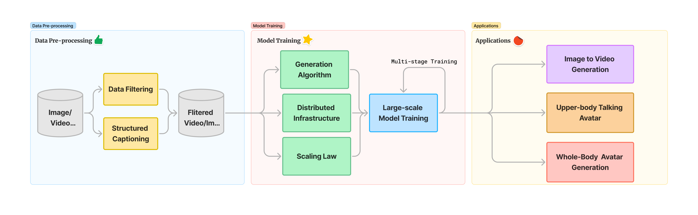
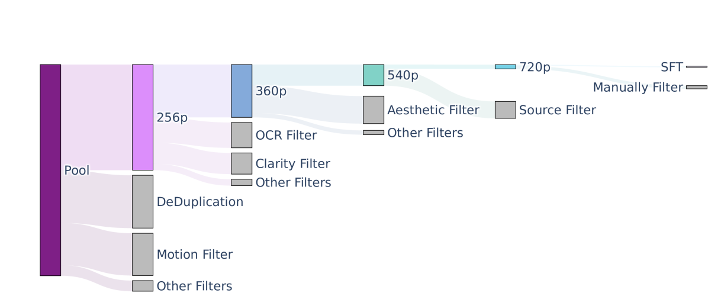
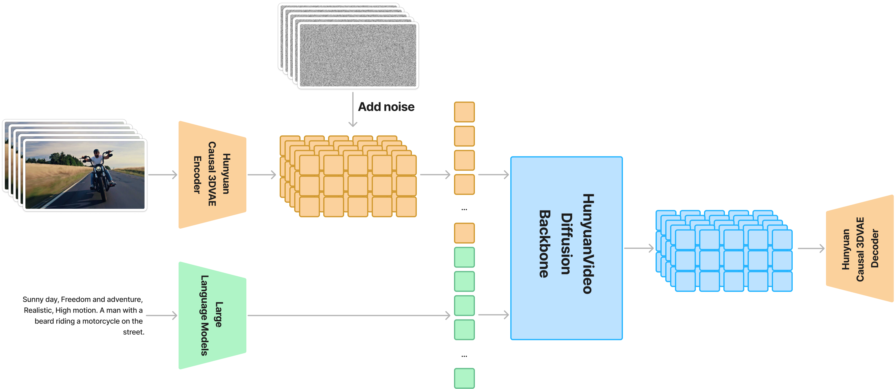
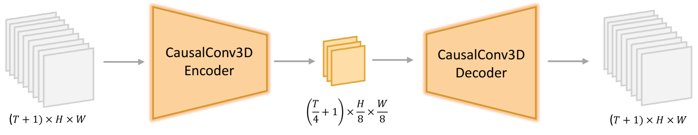
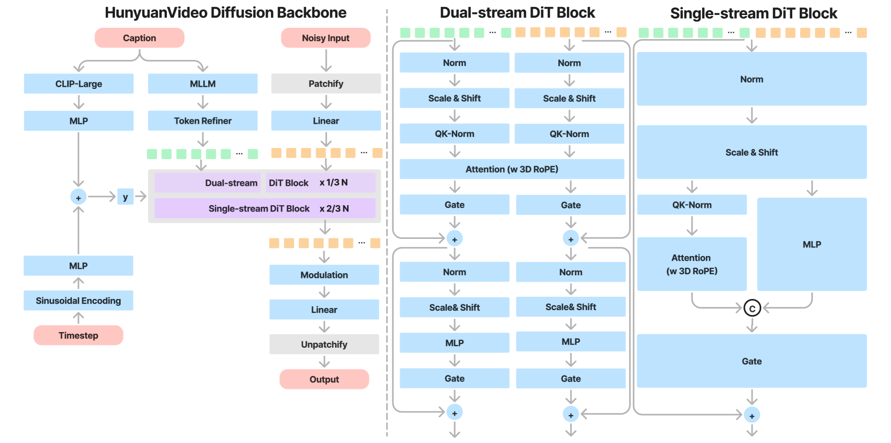
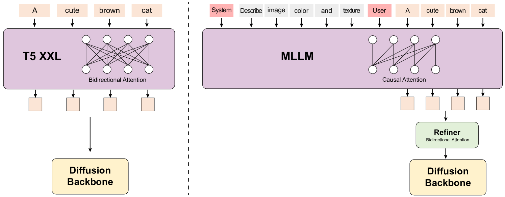
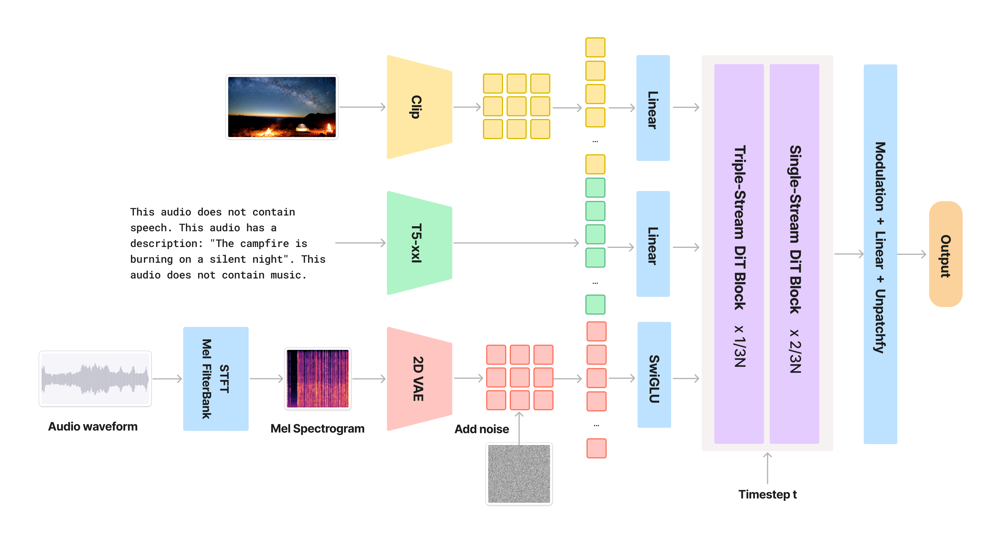
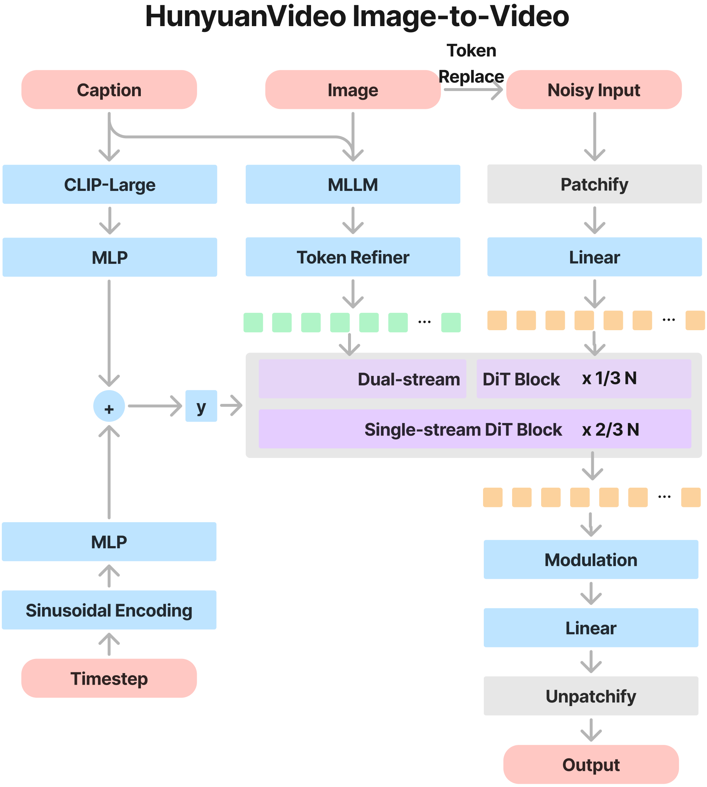
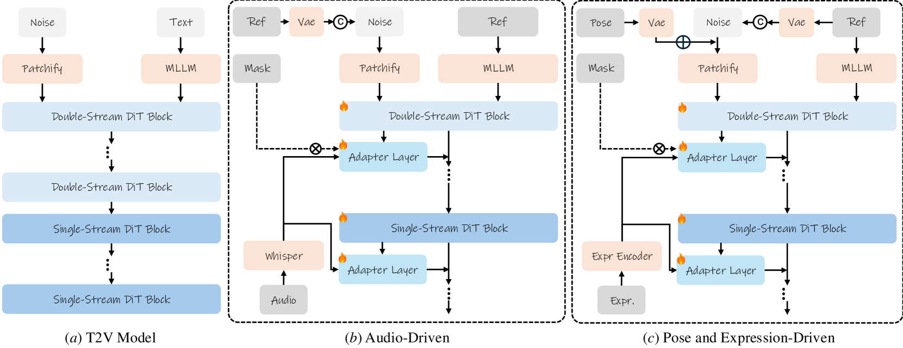
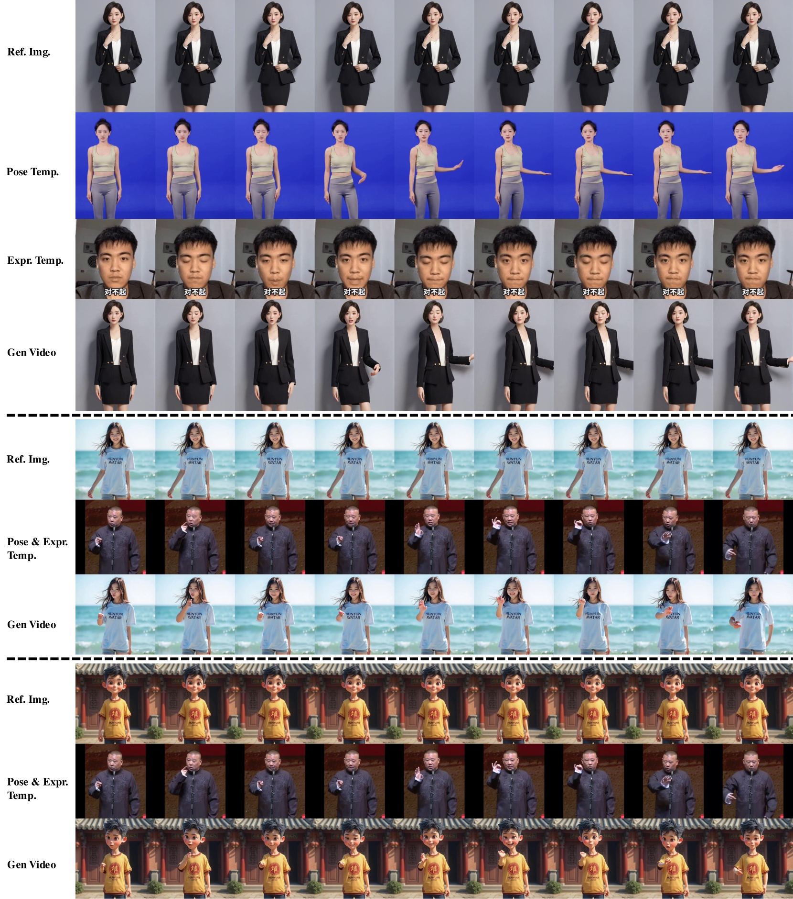

# HunyuanVideo: A Systematic Framework For Large Video Generative Models
## 论文汇报

---

## 目录
1. [研究背景与动机](#研究背景与动机)
2. [整体系统架构](#整体系统架构)
3. [数据预处理](#数据预处理)
4. [模型架构设计 - Model Architecture](#模型架构设计---model-architecture)
5. [应用场景 - Applications](#应用场景---applications)
6. [模型加速 - Model Acceleration](#模型加速---model-acceleration)
7. [基础模型性能 - Foundation Model](#基础模型性能---foundation-model)
8. [总结与贡献](#总结与贡献)

---

## 研究背景与动机

HunyuanVideo是首个开源的大规模视频生成基础模型，旨在缩小开源与闭源视频生成模型之间的性能差距。

### 主要贡献
- **参数规模**: 130亿参数，是目前最大的开源视频生成模型
- **性能表现**: 在专业人员评估中超越了Runway Gen-3、Luma 1.6等顶级模型
- **开源策略**: 完整开源代码和模型，促进社区发展

---

## 整体系统架构

### 整体训练系统

系统采用**3DVAE + Diffusion Backbone**的架构设计，从数据预处理到模型训练形成完整流水线：

1. **数据处理**: 视频分割 → 质量过滤 → 结构化标注
2. **模型训练**: 3DVAE预训练 → 分阶段扩散模型训练
3. **推理生成**: 文本编码 → 扩散去噪 → 视频解码

---

## 数据预处理

### 数据过滤流程

1. **视频分割与筛选**
   - 使用PySceneDetect和OpenCV的Laplacian算子将视频分割成单镜头片段
   - 通过内部训练的VideoCLIP进行嵌入编码
   - 基于余弦相似度去除重复片段
   - 使用k-means聚类产生~10K概念中心

2. **多层次过滤器**
   - **Dover**: 美学/技术质量评估
   - **光流估计**: 过滤静态/慢动作视频
   - **OCR**: 删除过多文本内容
   - **YOLOX模型**: 去除遮挡/敏感信息

3. **分层数据构建**
   - 生成5个视频训练数据集，对应5个训练阶段
   - 分辨率从256×256×65逐步提升至720×1280×129
   - 建立2个图像数据集用于text-to-image预训练

### 数据标注
- **结构化字幕**: 使用内部VLM生成JSON格式的多维描述
- **相机运动类型**: 训练14种相机运动分类器

---

## 模型架构设计 - Model Architecture

### 详细架构

系统采用**3DVAE + Diffusion Backbone**的架构设计：

1. **输入**: 视频/图像 → 3DVAE编码器 → 潜在时空特征 + 噪声
2. **文本处理**: 结构化字幕 → LLM编码 → 一维特征向量
3. **扩散过程**: 加噪潜在特征 + 文本特征 → Diffusion Backbone → 重构潜在特征
4. **输出**: 重构潜在特征 → 3DVAE解码器 → 重构视频/图像

### 3D变分自编码器 (3DVAE)

#### VAE理论基础
变分自编码器(VAE)是一种深度生成模型，通过学习数据的潜在表示来实现数据的生成和重构。

VAE的目标是最大化数据的边缘似然$p(x)$，但真实后验$p(z|x) = \frac{p(x|z)p(z)}{p(x)}$由于分母$p(x)$难以计算而无法直接优化。因此VAE引入变分后验$q_{\phi}(z|x)$来近似真实后验，并通过优化Evidence Lower Bound (ELBO)来间接最大化$p(x)$：

$L_{ELBO} = E_{q_{\phi}(z|x)}[\log p_{\theta}(x|z)] - D_{KL}(q_{\phi}(z|x) \| p(z))$

其中第一项为重构项，第二项为正则化项。

##### 3DVAE针对视频的扩展

- **编码器特性**:
  - 使用因果3D卷积(CausalConv3D)保证时间序列顺序性
  - 输入尺寸: $(T+1) \times H \times W$
  - 输出压缩: $(\frac{T}{4}+1) \times \frac{H}{8} \times \frac{W}{8}$，通道数C=16

- **损失函数设计**:
$Loss = L_1 + 0.1L_{lpips} + 0.05L_{adv} + 10^{-6}L_{kl}$

##### 损失函数组成
1. **重构损失组合** ($L_1 + L_{lpips} + L_{adv}$)：
   - **L₁损失**: 像素级重建，确保基础内容还原
   - **感知损失($L_{lpips}$)**: 通过预训练网络提取高层语义特征，提升视觉真实感
   - **对抗损失($L_{adv}$)**: 通过GAN机制增强细节真实性

2. **KL散度损失** ($L_{kl}$)：
   - 约束潜在空间特征分布接近标准正态分布
   - 权重设置为$10^{-6}$，保证生成质量的同时维持潜在空间的规整性

### 统一图像视频生成架构

#### 核心设计理念
1. **Full Attention机制**: 相比分割时空注意力表现更优
2. **统一处理**: 支持图像和视频的统一生成
3. **高效加速**: 更好地利用LLM相关的加速能力

#### 文本编码器

- **多模态大语言模型(MLLM)**: 
  - Decoder-Only结构，更好的图像-文本对齐
  - 相比T5的Encoder-Decoder结构有更好的语义对齐能力
  - 添加Refiner模块进行双向注意力处理

- **CLIP特征融合**: 
  - 提取全局文本表示
  - 与时间步嵌入结合输入模型

#### 双流到单流设计
- **双流阶段**: 视频和文本标记独立处理，学习各自的调制机制
- **单流阶段**: 连接视频和文本标记，实现有效的多模态信息融合
- **位置编码**: 使用3D RoPE支持多分辨率、多纵横比生成

#### 模型缩放定律
基于控制变量实验建立缩放定律：
$$N_{opt} = a_1 \cdot C^{b_1}, \quad D_{opt} = a_2 \cdot C^{b_2}$$

通过图像模型(T2X(I))到视频模型(T2X(V))的渐进缩放，最终确定13B参数规模。

### 模型预训练策略

#### Flow Matching训练框架
- **技术选择**: HunyuanVideo采用Flow Matching框架替代传统的DDPM扩散模型
- **基本原理**: 通过学习从噪声到数据的连续变换路径，模型预测每个时间步的速度场
- **训练目标**: 最小化预测速度与真实变换速度的均方误差

#### 分阶段训练策略
1. **图像预训练阶段**
   - **第一阶段**: 256px低分辨率图像预训练，支持多纵横比训练，学习低频概念
   - **第二阶段**: 256px与512px混合规模训练，动态调整批次大小，维持低分辨率能力

2. **视频-图像联合训练阶段**
   - **数据分组**: 按时长和纵横比对视频数据分组，随机选组优化资源利用
   - **渐进式课程学习**: 
     - 低分辨率短视频 → 低分辨率长视频 → 高分辨率长视频
     - 各阶段融入不同比例图像，防止图像语义遗忘

### 提示重写机制

#### 核心功能
- **多语言适配**: 处理和理解各种语言的用户提示，保持语义完整性
- **结构化标准化**: 将用户提示重构为标准化信息架构，类似训练字幕格式
- **复杂术语简化**: 将复杂用户表述转换为更直接的表达，保持原始意图

#### 技术实现
- **基础模型**: 使用Hunyuan-Large大模型作为提示重写的核心引擎
- **LoRA微调**: 对Hunyuan-Large进行LoRA微调，专门适配视频生成任务需求
- **自我修正**: 实施自我修正技术，对比原始提示和重写版本确保准确性

---

## 应用场景 - Applications

### 1. 基于视频的音频生成

#### 数据处理
- 过滤无音频流或静音比例超80%的视频
- 使用帧级音频检测模型分类：纯声音、声音+语音、声音+音乐、纯音乐
- 基于视觉-音频一致性评分筛选高质量数据

#### 模型架构
- **三流结构**: 独立处理视觉、音频、文本模态
- **Flow Matching**: 基于扩散Transformer的架构
- **特征提取**: CLIP(视觉) + T5(文本) → DiT兼容潜在空间
- **音频重建**: VAE解码器 + HifiGAN声码器

### 2. 图像到视频生成

#### 预训练策略
- **Token替换技术**: 准确重构原始图像信息的核心机制
  - **机制原理**: 将参考图像的潜在表示直接作为第一帧的latent token
  - **时间步设置**: 参考图像对应的timestep设置为0，表示无需去噪
  - **其余帧处理**: 其他帧latent的处理与T2V训练保持一致
- **语义图像注入**: MLLM处理输入图像获取语义token
- **联合训练**: 在T2V相同数据上预训练

#### 下游任务微调
- **肖像视频生成**: 200万肖像视频监督微调
- **渐进解冻**: 逐层解冻模型参数保持泛化能力
- **视频插值**: 支持首末帧条件的视频插值

### 3. 头像动画生成

#### 技术架构深度解析

##### Mask机制的核心作用
- **区域控制**: 在头像动画中，mask用于控制不同身体区域的影响范围
- **面部遮罩**: 控制音频驱动效果只作用于面部区域，避免对身体造成不必要的变形
- **表情区域约束**: 在表情驱动中，mask确保表情变化只影响面部特征，保持身体姿态稳定
- **多模态融合控制**: 在混合条件驱动中，不同mask控制不同模态的作用区域

##### Adapter Layer vs LoRA
**为什么使用Adapter而非LoRA？**
- **结构灵活性**: Adapter可插入Transformer block任意位置，LoRA只能挂载在Linear层
- **任务解耦**: 支持多任务共存，不同子任务使用专属Adapter，避免任务冲突
- **条件控制**: 支持gating、masking等动态控制机制
- **非线性建模**: Adapter包含非线性激活，表达力比LoRA的线性低秩矩阵更强

**Adapter架构**: Input → Down-Projection → ReLU → Up-Projection → Output

##### 为什么图(b)(c)使用Ref而非Text？

**核心原因**: 文本无法精准描述细微的表情和姿态变化

| 子任务 | 条件来源 | 为什么不用文本 | 替代方案 | 作用 |
|--------|----------|----------------|----------|------|
| (a) 文生视频 | Text Prompt | 适合高层语义描述 | Text embedding (CLIP) | 高层语义引导 |
| (b) 表情驱动 | Ref 表情帧 | "微笑"等词汇过于模糊 | Ref → MLLM token | 精确面部运动语义 |
| (c) 姿态驱动 | Ref 姿势图 | 无法描述复杂肢体动作 | Ref → MLLM token | 全身骨架/动作语义 |

**技术优势**:
- **Rich视觉语义**: Ref图像通过MLLM提取包含头部朝向、眉毛状态、嘴部张合等丰富特征
- **直接示范**: 图像直接"展示"目标表情/动作，比文本描述更精确
- **细节保持**: 避免文本表达的模糊性导致的生成偏差

#### 上身说话头像
- **音频驱动**: Whisper特征提取 + 交叉注意力注入
- **面部遮罩**: 控制音频效果区域，减少身体变形
- **动态参数**: 头部姿态和表情运动参数嵌入

#### 全身可控头像

- **姿态驱动**: DWPose骨骼检测 + 3DVAE潜在空间注入
- **表情驱动**: VASA隐式表情表示 + 交叉注意力
- **混合控制**: 姿态+表情的端到端联合微调

---

## 模型加速 - Model Acceleration

### 推理步数减少
- **时间步偏移策略**: $t' = \frac{s \cdot t}{1 + (s-1) \cdot t}$
- **自适应偏移因子**: 50步时s=7，小于20步时s=17
- **性能优势**: 相比线性-二次调度器在极低步数(10步)下效果更佳

### 文本引导蒸馏
- **无分类器引导(CFG)加速**: 将条件和无条件输出蒸馏到单个学生模型
- **引导尺度采样**: 1-8随机采样训练
- **加速效果**: 约1.9倍推理加速

### 高效可扩展训练
#### 硬件基础设施
- **腾讯星脉网络**: 高效服务器间通信
- **Angel机器学习平台**: 强大的资源管理和调度

#### 5D并行策略
- **张量并行(TP)**: 矩阵块计算分布
- **序列并行(SP)**: 基于TP的输入序列维度切片
- **上下文并行(CP)**: Ring Attention支持长序列训练
- **数据并行+ZeroCache**: 模型状态冗余优化

#### 优化技术
- **注意力优化**: FusedAttention加速
- **重计算与激活卸载**: 计算换存储策略
- **自动容错**: 99.5%训练稳定性

---

## 基础模型性能 - Foundation Model

### 与SOTA模型对比
在1533个文本提示上与5个强基线模型对比：

| 模型 | 持续时间 | 文本对齐 | 运动质量 | 视觉质量 | 总体排名 |
|------|----------|----------|----------|----------|----------|
| **HunyuanVideo** | 5s | **61.8%** | **66.5%** | 95.7% | **1** |
| CNTopA | 5s | 62.6% | 61.7% | 95.6% | 2 |
| CNTopB | 5s | 60.1% | 62.9% | **97.7%** | 3 |
| GEN-3 alpha | 6s | 47.7% | 54.7% | 97.5% | 4 |
| Luma1.6 | 5s | 57.6% | 44.2% | 94.1% | 5 |

### 核心能力展示
1. **文本对齐**: 准确捕获多主体场景关系
2. **高质量生成**: 超详细内容生成能力  
3. **高动态运动**: 广泛场景和运动类型覆盖
4. **概念泛化**: 训练数据外的新概念组合
5. **动作推理**: 基于LLM的序列动作规划
6. **文字理解**: 场景文本和手写文本生成

---

## 总结与贡献

### 主要创新点
1. **视频生成缩放定律**: 首次建立视频生成模型的参数-性能缩放关系
2. **3DVAE时空编码**: 针对视频时空特征的因果3D卷积变分自编码器设计
3. **分阶段渐进训练**: 图像→视频的课程学习策略，防止语义遗忘
4. **智能提示重写**: 基于Hunyuan-Large+LoRA的多语言提示标准化机制

### 主要贡献
1. **开源最大规模**: 130亿参数的开源视频生成模型
2. **系统性工程方案**: 从数据预处理到应用部署的完整技术体系
3. **多模态应用生态**: 音频生成、I2V、头像动画等统一框架下的应用扩展
4. **工程优化实践**: 5D并行训练和高效推理的工程化解决方案

### 技术特色
- **规模优势**: 130亿参数，目前最大的开源视频生成模型
- **性能卓越**: 在文本对齐、运动质量等维度超越闭源SOTA模型
- **工程完备**: 从数据到应用的全链路技术方案
- **理论结合**: VAE理论基础与工程实践的有效结合
- **应用丰富**: 不仅是基础模型，更提供完整的应用解决方案

### 开源价值
- **技术开放**: 完整开源代码、模型权重和训练细节
- **门槛降低**: 让更多研究者能够复现和改进视频生成技术
- **生态推动**: 为开源社区提供与商业模型竞争的强大基础
- **知识共享**: 详细的技术报告和实现细节促进学术交流

### 实际影响
HunyuanVideo通过开源130亿参数的高质量视频生成模型，不仅缩小了开源与闭源模型的性能差距，更建立了从数据处理、模型训练到应用部署的完整技术体系。这为视频生成领域的进一步发展奠定了坚实基础，推动了整个开源生态的繁荣。
