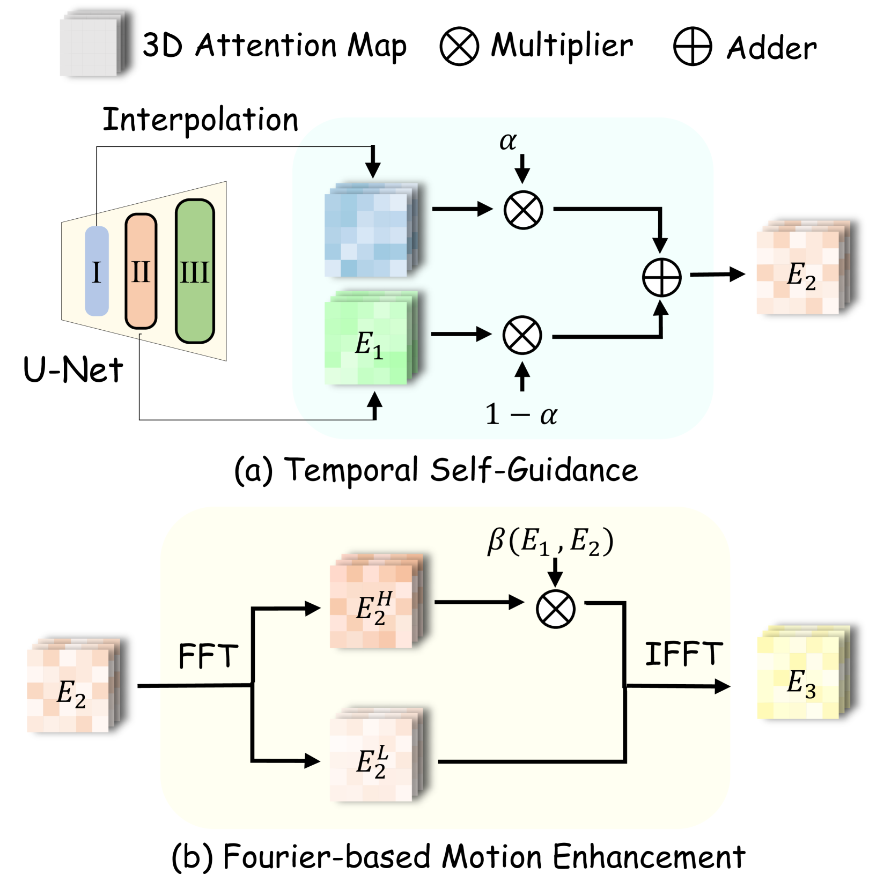

# ByTheWay: Boost Your Text-to-Video Generation Model to Higher Quality in a Training-free Way

## 1. 论文概述

### 1.1 基本信息
- **论文标题**: ByTheWay: Boost Your Text-to-Video Generation Model to Higher Quality in a Training-free Way
- **发表信息**: arXiv:2410.06241v3
- **研究领域**: 文本到视频生成 (T2V)、扩散模型

### 1.2 研究动机与问题

当前文本到视频(T2V)扩散模型虽然取得显著进展，但仍存在两大核心问题：

**传统解决方案的局限**：
- 依赖昂贵的重新训练
- 需要更大的数据集和模型
- 计算成本高，部署困难

**Figure 1**：展示ByTheWay通过训练无关方式提升T2V模型质量，同时解决结构问题和运动不足，可即插即用集成到各种T2V骨干网络。

## 2. 核心观察与发现

### 2.1 关键观察

作者通过深入分析temporal attention机制，发现了两个重要关联：

#### 观察1：Attention差异与结构问题的关联

**Figure 2(a)**：统计分析显示，结构异常视频的不同decoder block间temporal attention map差异更大，而好视频的差异较小。

**发现**：不同decoder block间temporal attention map差异越大 → 视频结构越不合理、时间越不连续

**验证方法**：
- 分析100个好视频 vs 100个坏视频
- 计算up_blocks.1与后续blocks间attention map的L2距离
- 统计结果显示强相关性

**Figure 2(b)**：应用ByTheWay后，原本损坏视频中的建模差异被减少到了良好生成视频的水平，验证了方法的有效性。

#### 观察2：Attention能量与运动幅度的关联

**Figure 2(c)**：散点图显示temporal attention map能量与视频运动幅度之间的正相关关系，为能量驱动的运动增强提供理论依据。

**发现**：temporal attention map的能量越高 → 视频运动幅度越大

**验证方法**：
- 使用RAFT提取光流，计算真实运动强度
- 定义attention map能量：$E = \frac{1}{F}\sum_{i=0}^{F-1}\sum_{j=0}^{F-1}\|\mathcal{A}_{...,i,j}\|^2$
- 证实能量与运动幅度正相关

## 3. ByTheWay方法详解

### 3.1 整体架构

**Figure 6**：ByTheWay的两个核心操作模块：(a) Temporal Self-Guidance通过注入up_blocks.1的attention信息增强结构一致性；(b) Fourier-based Motion Enhancement通过缩放高频成分放大运动幅度。

**特点**：
- 训练无关 (Training-free)
- 无额外参数
- 无额外计算成本
- 仅在推理前20%步骤激活

### 3.2 Temporal Self-Guidance (时序自指导)

#### 3.2.1 Temporal Attention Map结构

在T2V模型中，temporal attention机制处理5D视频特征$f \in \mathbb{R}^{B \times C \times F \times H \times W}$，其中：
- $B$: 批次大小
- $C$: 通道数  
- $F$: 帧数
- $H, W$: 空间分辨率

通过重塑为3D形式$f' \in \mathbb{R}^{(B \times H \times W) \times C \times F}$，temporal attention在时间维度执行自注意力操作，生成attention map $\mathcal{A} \in \mathbb{R}^{(B \times H \times W) \times F \times F}$，反映帧间时间相关性。

#### 3.2.2 问题分析

**核心问题**：不同decoder block的temporal attention map行为不一致

**现象举例**：
- Block 1: Frame_3关注Frame_2(40%), Frame_3(30%), Frame_4(30%)
- Block 2: Frame_3关注Frame_1(10%), Frame_3(90%), others(0%)

#### 3.2.3 解决方案

**核心公式**：
$$\mathcal{A}_m \leftarrow \mathcal{A}_m + \alpha(\mathcal{A}_{1\rightarrow m} - \mathcal{A}_m)$$

其中：
- $\mathcal{A}_m$：第m层的temporal attention map
- $\mathcal{A}_{1\rightarrow m}$：第1层上采样后的attention map
- $\alpha$：引导强度参数

**数学本质**：插值更新
$$\mathcal{A}_m \leftarrow (1-\alpha)\mathcal{A}_m + \alpha\mathcal{A}_{1\rightarrow m}$$

**效果**：
- 减少层间attention差异
- 提升结构合理性和时间一致性

**Figure 3**：Temporal Self-Guidance通过将up_blocks.1的temporal attention信息注入后续块，恢复崩坏结构并保持运动一致性。

### 3.3 Fourier-based Motion Enhancement (傅里叶运动增强)

#### 3.3.1 理论基础

**核心发现**：视频运动主要体现在temporal attention map的高频成分中

**Figure 4**：展示具有更丰富运动的样本具有更高的temporal attention能量，验证能量与运动幅度的直接关联性。

**Figure 5**：频率分解实验证明视频运动主要存在于temporal attention map的高频成分中，低频成分对应静态结构。

**实验验证**：
- 只保留低频 → 几乎静态
- 只保留高频 → 有运动但不稳定
- 增强高频 → 运动丰富且稳定

#### 3.3.2 技术实现

**1D FFT在时间维度的应用**：

对于temporal attention map $\mathcal{A} \in \mathbb{R}^{(B \times H \times W) \times F \times F}$，我们沿着softmax维度(最后一个F维度)执行1D快速傅里叶变换。这是因为：

- Softmax维度表示每一帧对其他帧的注意力权重分布
- 该维度的频域特性直接反映时间动态模式
- 高频成分对应快速变化的帧间关系(运动)
- 低频成分对应缓慢变化的帧间关系(静态结构)

**步骤流程**：

**核心公式**：
$$\mathcal{A}' = \mathcal{F}^{-1}(\beta \cdot \mathbf{A}_H + \mathbf{A}_L)$$

其中：
- $\mathcal{F}$：快速傅里叶变换
- $\beta > 1$：高频增强因子
- $\tau$：高频范围参数

#### 3.3.3 理论保证

**Theorem 1**：增强后的$\mathcal{A}'$保持softmax性质
- 证明：DC分量$X[0]$不变，保证归一性

**Theorem 2**：当$\beta > 1$时，能量增加
- 能量变化：$\Delta E = \frac{\beta^2-1}{F}\sum_{k \in HF}|X[k]|^2 > 0$

### 3.4 自适应β调节策略

为确保增强后能量$E_3 \geq E_1$，引入自适应调节：

$$\beta(E_1, E_2) = \max\left\{\beta_0, \sqrt{\frac{E_1 - E_2^L}{E_2^H}}\right\}$$

**参数含义**：
- $E_1$：原始attention能量
- $E_2^L, E_2^H$：Self-Guidance后的低频、高频能量
- $\beta_0$：用户设定的最小值

**Figure 12**：自适应β参数调节策略，根据Temporal Self-Guidance前后的能量变化自动调整高频增强因子，确保运动增强效果。

## 4. 实验设计与结果

### 4.1 实验设置

**基础模型**：
- AnimateDiff (512×512) + Realistic Vision V5.1 LoRA
- VideoCrafter2 (320×512)

**参数配置**：
| 模型 | α | β | τ |
|------|---|---|---|
| AnimateDiff | 0.6 | 1.5 | 7 |
| VideoCrafter2 | 0.1 | 10 | 7 |

**评估指标**：
1. 用户主观评估（30人）
2. GPT-4o多模态评估
3. VBench客观指标

### 4.2 定性结果分析

**Figure 7**：AnimateDiff模型使用ByTheWay前后的对比，展示在结构一致性和动态效果方面的显著改善。

**Figure 8**：VideoCrafter2模型的对比结果，ByTheWay成功重建结构并增强运动，使视频更加同步美观。

**显著改善**：
- "绿毛线娃娃"：修复头尾结构崩塌
- "吉普车"：增强场景动态效果
- "赛马"：修复马腿异常，动作更流畅
- "企鹅滑冰"：保持结构同时增强运动

### 4.3 与FreeInit对比

**Figure 9**：与FreeInit的对比显示，FreeInit会导致运动显著损失产生静态视频，而ByTheWay同时增强结构连贯性和运动幅度。

| 方法 | 结构改善 | 运动保持 | 推理开销 |
|------|----------|----------|----------|
| FreeInit | ✅ | ❌ (运动显著减弱) | 5倍时间 |
| ByTheWay | ✅ | ✅ (运动增强) | 几乎无额外开销 |

### 4.4 定量评估结果

#### 4.4.1 用户研究与MLLM评估

**Table 1: 投票结果**
| 评估指标 | 模型 | 原版 | +ByTheWay |
|----------|------|------|-----------|
| 视频质量 | AnimateDiff | 25.42% | **74.58%** |
| 结构合理性 | AnimateDiff | 41.94% | **58.06%** |
| 运动一致性 | AnimateDiff | 34.62% | **65.38%** |
| 视频质量 | VideoCrafter2 | 30.54% | **69.46%** |
| 结构合理性 | VideoCrafter2 | 18.48% | **81.52%** |
| 运动一致性 | VideoCrafter2 | 39.60% | **60.40%** |

#### 4.4.2 VBench客观指标

**Table 2: VBench评估结果**
| 指标 | AnimateDiff | +FreeInit | +ByTheWay | VideoCrafter2 | +ByTheWay |
|------|-------------|-----------|-----------|---------------|-----------|
| Subject Consistency↑ | 0.9318 | 0.9712 | **0.9744** | 0.9732 | **0.9852** |
| Motion Smoothness↑ | 0.9474 | 0.9713 | **0.9786** | 0.9749 | **0.9863** |
| Dynamic Degree↑ | 0.4073 | 0.2941 | **0.5245** | 0.4086 | **0.5547** |
| Aesthetic Quality↑ | 0.6376 | 0.6571 | **0.6609** | 0.6477 | **0.6598** |

**关键观察**：
- ByTheWay在所有指标上都优于原始模型
- 特别是在Dynamic Degree上提升显著（AnimateDiff: 0.4073→0.5245）
- 相比FreeInit，ByTheWay保持了更好的运动特性

### 4.5 消融实验

**Figure 10**：关键参数α、β、τ的消融实验结果，虚线框表示实验中选择的最优参数配置。

**参数影响分析**：

**α (Self-Guidance强度)**：
- 过小：引导效果弱
- 过大：抑制运动，趋向静态

**β (高频增强倍率)**：
- 过小：运动增强不足
- 过大：产生异常运动artifacts

**τ (高频范围)**：
- 越大：捕捉更多运动分量
- 需要平衡增强效果与稳定性

**最优参数组合分析**：
- AnimateDiff: α=0.6, β=1.5, τ=7 达到最佳平衡
- VideoCrafter2: α=0.1, β=10, τ=7 适应其运动特性
- 不同模型需要调整参数以适应其内在的运动建模偏好

**Figure 14**：实验证明up_blocks.1是视频运动建模的瓶颈，将其信息注入后续块能有效对齐跨层运动建模。

### 4.6 扩展应用：Image-to-Video

**Figure 11**：ByTheWay在I2V任务中的应用效果，在保持参考图像结构完整性的同时增强合成视频的动态效果。

**SparseCtrl + ByTheWay**：
- 保持参考图像结构完整性
- 增强波浪、光影等动态美学效果
- 证明方法的广泛适用性

**扩展应用价值**：
这些实验结果表明，ByTheWay有效增强了T2V和I2V生成任务的质量，将其定位为视频扩散模型的多功能且强大的增强工具。

**Figure 13**：ByTheWay在DiT-based架构CogVideoX上展现运动增强潜力，证明方法的广泛适用性。

## 5. 技术创新点与贡献

### 5.1 理论贡献

1. **首次系统分析**temporal attention与视频质量的关联：
   - Attention差异 ↔ 结构问题
   - Attention能量 ↔ 运动幅度

2. **频域运动增强理论**：
   - 证明高频分量承载运动信息
   - 提供数学理论保证

3. **自适应参数调节策略**：
   - 确保能量守恒
   - 防止过度增强

**Figure 17**：AnimateDiff模型应用ByTheWay后的运动增强对比，展示方法在提升视频动态性方面的显著效果。

### 5.2 方法创新

### 5.3 实用价值

1. **零成本部署**：无需额外训练或参数
2. **即时效果**：显著提升现有模型质量
3. **广泛兼容**：适用于主流T2V/I2V模型
4. **工程友好**：简单集成，易于复现

## 6. 局限性与未来工作

### 6.1 当前局限

1. **参数敏感性**：不同模型需要调整参数
2. **频域假设**：基于高频=运动的假设，可能不适用所有场景
3. **处理范围**：仅在前20%步骤处理，可能错过后期细节

### 6.2 未来方向

1. **自动参数优化**：开发自适应参数选择策略
2. **更精细的频域分析**：结合语义信息的频域处理
3. **端到端集成**：直接集成到训练过程
4. **更多模态扩展**：支持音频、3D等多模态生成

## 7. 总结

ByTheWay提出了一个简单而有效的训练无关视频增强方法：

**核心思想**：
- 通过分析temporal attention机制的内在规律
- 设计针对性的后处理策略
- 同时解决结构和运动两大问题

**技术优势**：
- ✅ 训练无关，即插即用
- ✅ 理论有保证，效果显著
- ✅ 计算成本低，易于部署
- ✅ 适用性广，兼容性强

**实际意义**：
为现有T2V模型提供了一个低成本、高效果的质量提升方案，具有重要的学术价值和实用价值。

**Figure 18**：ByTheWay方法的综合效果展示，通过多个代表性场景展示在解决结构问题和运动不足方面的整体效果。

**Figure 19**：方法应用前后的定量和定性对比总结，综合展示在不同评估指标下的提升效果。

---

## 参考文献

- 原论文：arXiv:2410.06241v3
- 相关工作：AnimateDiff, VideoCrafter2, FreeInit, SparseCtrl等
- 评估工具：VBench, RAFT, GPT-4o
