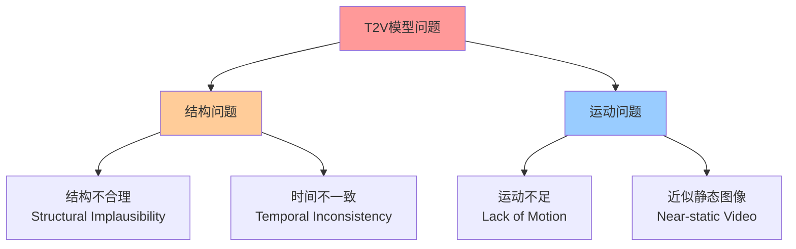
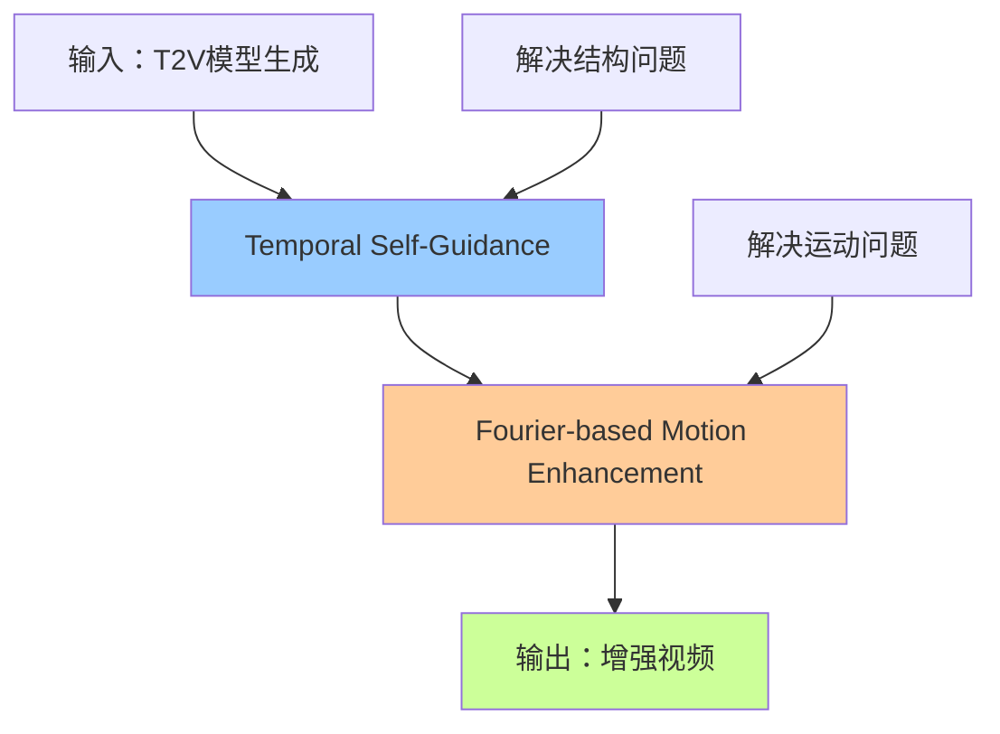
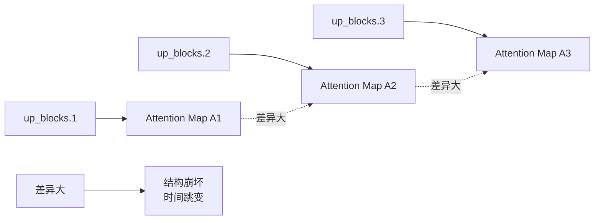
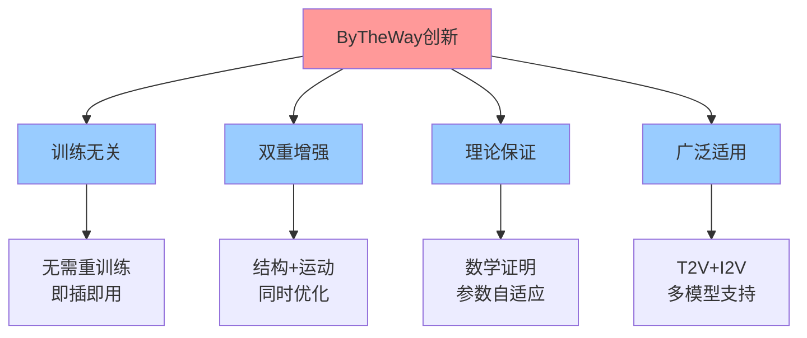

# ByTheWay: Boost Your Text-to-Video Generation Model to Higher Quality in a Training-free Way

## 1. 论文概述

### 1.1 基本信息
- **论文标题**: ByTheWay: Boost Your Text-to-Video Generation Model to Higher Quality in a Training-free Way
- **发表信息**: arXiv:2410.06241v3
- **研究领域**: 文本到视频生成 (T2V)、扩散模型

### 1.2 研究动机与问题

当前文本到视频(T2V)扩散模型虽然取得显著进展，但仍存在两大核心问题：



**传统解决方案的局限**：
- 依赖昂贵的重新训练
- 需要更大的数据集和模型
- 计算成本高，部署困难

## 2. 核心观察与发现

### 2.1 关键观察

作者通过深入分析temporal attention机制，发现了两个重要关联：

#### 观察1：Attention差异与结构问题的关联


**发现**：不同decoder block间temporal attention map差异越大 → 视频结构越不合理、时间越不连续

**验证方法**：
- 分析100个好视频 vs 100个坏视频
- 计算up_blocks.1与后续blocks间attention map的L2距离
- 统计结果显示强相关性

#### 观察2：Attention能量与运动幅度的关联


**发现**：temporal attention map的能量越高 → 视频运动幅度越大

**验证方法**：
- 使用RAFT提取光流，计算真实运动强度
- 定义attention map能量：$E = \frac{1}{F}\sum_{i=0}^{F-1}\sum_{j=0}^{F-1}\|\mathcal{A}_{...,i,j}\|^2$
- 证实能量与运动幅度正相关

## 3. ByTheWay方法详解

### 3.1 整体架构




**特点**：
- 训练无关 (Training-free)
- 无额外参数
- 无额外计算成本
- 仅在推理前20%步骤激活

### 3.2 Temporal Self-Guidance (时序自指导)

#### 3.2.1 问题分析

**核心问题**：不同decoder block的temporal attention map行为不一致



**现象举例**：
- Block 1: Frame_3关注Frame_2(40%), Frame_3(30%), Frame_4(30%)
- Block 2: Frame_3关注Frame_1(10%), Frame_3(90%), others(0%)

#### 3.2.2 解决方案

**核心公式**：
$$\mathcal{A}_m \leftarrow \mathcal{A}_m + \alpha(\mathcal{A}_{1\rightarrow m} - \mathcal{A}_m)$$

其中：
- $\mathcal{A}_m$：第m层的temporal attention map
- $\mathcal{A}_{1\rightarrow m}$：第1层上采样后的attention map
- $\alpha$：引导强度参数

**数学本质**：插值更新
$$\mathcal{A}_m \leftarrow (1-\alpha)\mathcal{A}_m + \alpha\mathcal{A}_{1\rightarrow m}$$

**效果**：
- 减少层间attention差异
- 提升结构合理性和时间一致性
- 如Fig. 2(b)所示，处理后差异显著降低


### 3.3 Fourier-based Motion Enhancement (傅里叶运动增强)

#### 3.3.1 理论基础

**核心发现**：视频运动主要体现在temporal attention map的高频成分中


**实验验证**：
- 只保留低频 → 几乎静态
- 只保留高频 → 有运动但不稳定
- 增强高频 → 运动丰富且稳定

#### 3.3.2 技术实现

**步骤流程**：

```mermaid
flowchart LR
    A[Attention Map<br/>𝒜∈ℝ^(BHW)×F×F] --> B[FFT变换<br/>𝐀 = ℱ(𝒜)]
    B --> C[频率分解]
    C --> D[高频：𝐀_H<br/>k∈[F/2-τ, F/2+τ]]
    C --> E[低频：𝐀_L<br/>其余频率]
    D --> F[高频增强<br/>β·𝐀_H]
    F --> G[重构<br/>𝒜' = ℱ^(-1)(β·𝐀_H + 𝐀_L)]
    E --> G
```

**核心公式**：
$$\mathcal{A}' = \mathcal{F}^{-1}(\beta \cdot \mathbf{A}_H + \mathbf{A}_L)$$

其中：
- $\mathcal{F}$：快速傅里叶变换
- $\beta > 1$：高频增强因子
- $\tau$：高频范围参数

#### 3.3.3 理论保证

**Theorem 1**：增强后的$\mathcal{A}'$保持softmax性质
- 证明：DC分量$X[0]$不变，保证归一性

**Theorem 2**：当$\beta > 1$时，能量增加
- 能量变化：$\Delta E = \frac{\beta^2-1}{F}\sum_{k \in HF}|X[k]|^2 > 0$

### 3.4 自适应β调节策略

为确保增强后能量$E_3 \geq E_1$，引入自适应调节：

$$\beta(E_1, E_2) = \max\left\{\beta_0, \frac{E_1 - E_2^L}{E_2^H}\right\}$$

**参数含义**：
- $E_1$：原始attention能量
- $E_2^L, E_2^H$：Self-Guidance后的低频、高频能量
- $\beta_0$：用户设定的最小值


## 4. 实验设计与结果

### 4.1 实验设置

**基础模型**：
- AnimateDiff (512×512) + Realistic Vision V5.1 LoRA
- VideoCrafter2 (320×512)

**参数配置**：
| 模型 | α | β | τ |
|------|---|---|---|
| AnimateDiff | 0.6 | 1.5 | 7 |
| VideoCrafter2 | 0.1 | 10 | 7 |

**评估指标**：
1. 用户主观评估（30人）
2. GPT-4o多模态评估
3. VBench客观指标

### 4.2 定性结果分析


**显著改善**：
- "绿毛线娃娃"：修复头尾结构崩塌
- "吉普车"：增强场景动态效果
- "赛马"：修复马腿异常，动作更流畅
- "企鹅滑冰"：保持结构同时增强运动

### 4.3 与FreeInit对比


| 方法 | 结构改善 | 运动保持 | 推理开销 |
|------|----------|----------|----------|
| FreeInit | ✅ | ❌ (运动显著减弱) | 5倍时间 |
| ByTheWay | ✅ | ✅ (运动增强) | 几乎无额外开销 |

### 4.4 定量评估结果

#### 4.4.1 用户研究与MLLM评估

**Table 1: 投票结果**
| 评估指标 | 模型 | 原版 | +ByTheWay |
|----------|------|------|-----------|
| 视频质量 | AnimateDiff | 25.42% | **74.58%** |
| 结构合理性 | AnimateDiff | 41.94% | **58.06%** |
| 运动一致性 | AnimateDiff | 34.62% | **65.38%** |
| 视频质量 | VideoCrafter2 | 30.54% | **69.46%** |
| 结构合理性 | VideoCrafter2 | 18.48% | **81.52%** |
| 运动一致性 | VideoCrafter2 | 39.60% | **60.40%** |

#### 4.4.2 VBench客观指标

**Table 2: VBench评估结果**
| 指标 | AnimateDiff | +FreeInit | +ByTheWay | VideoCrafter2 | +ByTheWay |
|------|-------------|-----------|-----------|---------------|-----------|
| Subject Consistency↑ | 0.9318 | 0.9712 | **0.9744** | 0.9732 | **0.9852** |
| Motion Smoothness↑ | 0.9474 | 0.9713 | **0.9786** | 0.9749 | **0.9863** |
| Dynamic Degree↑ | 0.4073 | 0.2941 | **0.5245** | 0.4086 | **0.5547** |
| Aesthetic Quality↑ | 0.6376 | 0.6571 | **0.6609** | 0.6477 | **0.6598** |

### 4.5 消融实验


**参数影响分析**：

**α (Self-Guidance强度)**：
- 过小：引导效果弱
- 过大：抑制运动，趋向静态

**β (高频增强倍率)**：
- 过小：运动增强不足
- 过大：产生异常运动artifacts

**τ (高频范围)**：
- 越大：捕捉更多运动分量
- 需要平衡增强效果与稳定性

### 4.6 扩展应用：Image-to-Video


**SparseCtrl + ByTheWay**：
- 保持参考图像结构完整性
- 增强波浪、光影等动态美学效果
- 证明方法的广泛适用性

## 5. 技术创新点与贡献

### 5.1 理论贡献

1. **首次系统分析**temporal attention与视频质量的关联：
   - Attention差异 ↔ 结构问题
   - Attention能量 ↔ 运动幅度

2. **频域运动增强理论**：
   - 证明高频分量承载运动信息
   - 提供数学理论保证

3. **自适应参数调节策略**：
   - 确保能量守恒
   - 防止过度增强

### 5.2 方法创新



### 5.3 实用价值

1. **零成本部署**：无需额外训练或参数
2. **即时效果**：显著提升现有模型质量
3. **广泛兼容**：适用于主流T2V/I2V模型
4. **工程友好**：简单集成，易于复现

## 6. 局限性与未来工作

### 6.1 当前局限

1. **参数敏感性**：不同模型需要调整参数
2. **频域假设**：基于高频=运动的假设，可能不适用所有场景
3. **处理范围**：仅在前20%步骤处理，可能错过后期细节

### 6.2 未来方向

1. **自动参数优化**：开发自适应参数选择策略
2. **更精细的频域分析**：结合语义信息的频域处理
3. **端到端集成**：直接集成到训练过程
4. **更多模态扩展**：支持音频、3D等多模态生成

## 7. 总结

ByTheWay提出了一个简单而有效的训练无关视频增强方法：

**核心思想**：
- 通过分析temporal attention机制的内在规律
- 设计针对性的后处理策略
- 同时解决结构和运动两大问题

**技术优势**：
- ✅ 训练无关，即插即用
- ✅ 理论有保证，效果显著
- ✅ 计算成本低，易于部署
- ✅ 适用性广，兼容性强

**实际意义**：
为现有T2V模型提供了一个低成本、高效果的质量提升方案，具有重要的学术价值和实用价值。

---

## 参考文献

- 原论文：arXiv:2410.06241v3
- 相关工作：AnimateDiff, VideoCrafter2, FreeInit, SparseCtrl等
- 评估工具：VBench, RAFT, GPT-4o
