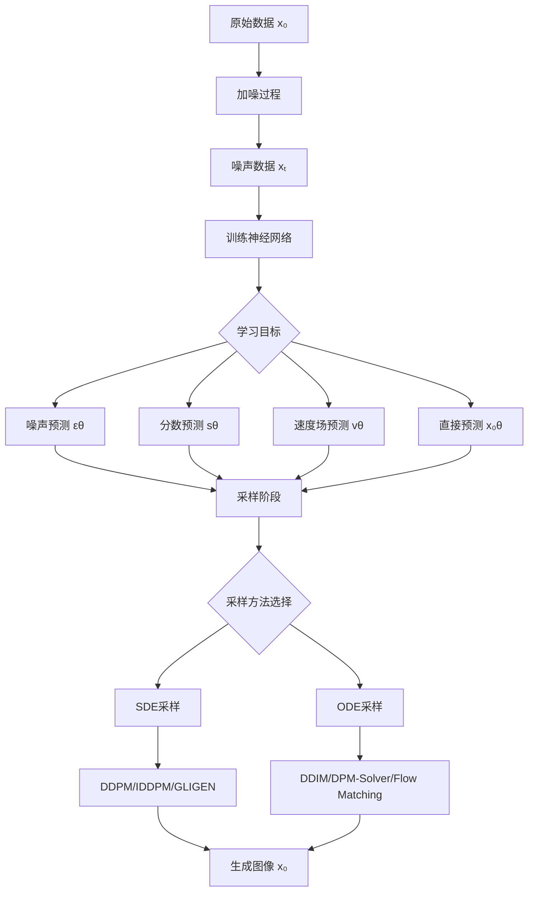
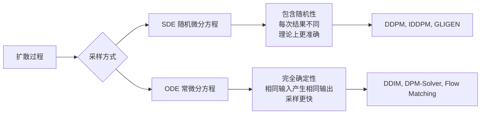
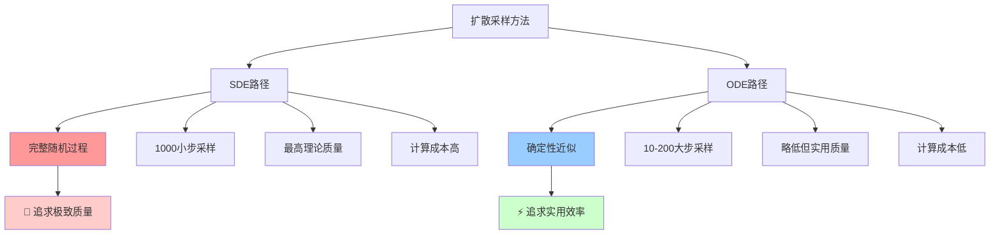
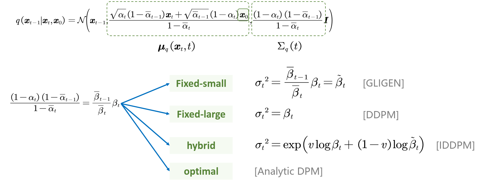
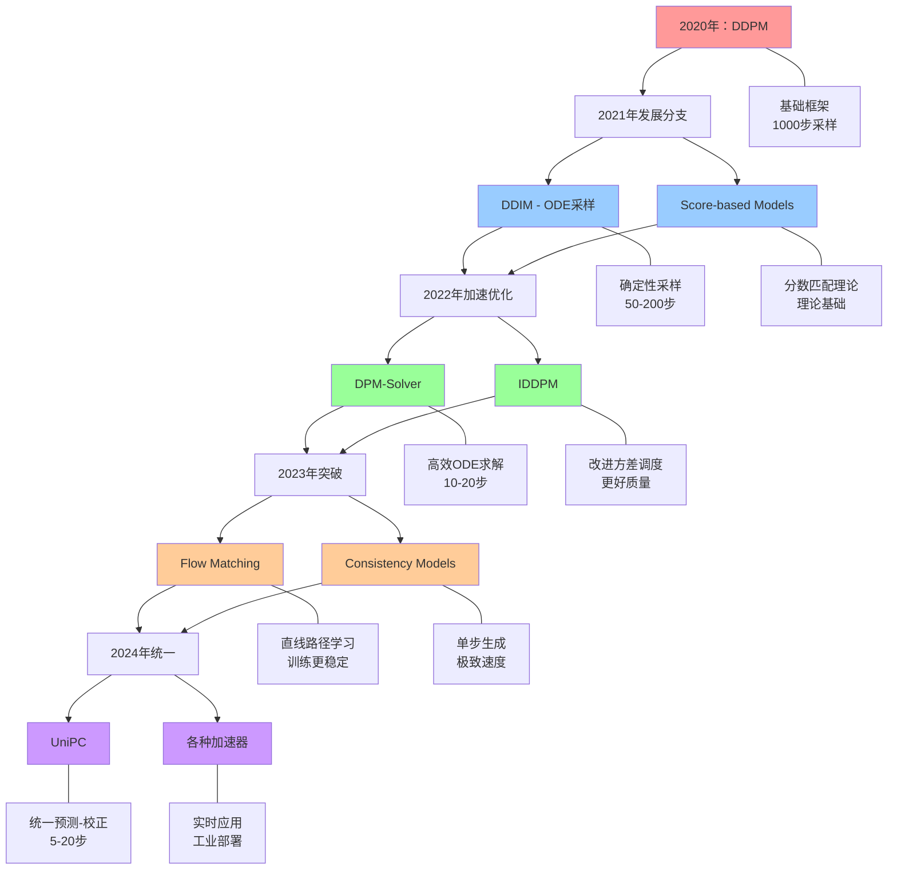

# 扩散模型完整总结

## 1. 扩散模型的核心框架

### 1.1 训练与采样的分离设计

**训练阶段：学习逆转换的关键参数**
- 目标：让神经网络学会从 $x_t$ 推导到 $x_{t-1}$ 所需的关键信息
- 不直接学习 $x_t \rightarrow x_{t-1}$ 的映射
- 而是学习转换过程中的关键组件（噪声、分数、速度场等）

**采样阶段：应用微分方程求解**
- 目标：从随机噪声 $x_T$ 生成真实图像 $x_0$
- 使用训练好的网络参数
- 应用不同的SDE/ODE求解器

### 1.2 框架流程图



## 2. 训练目标详细对比

| 方法类型 | 学习目标 | 数学表达 | 物理意义 |
|---------|---------|----------|----------|
| **噪声预测** | 预测添加的高斯噪声 | $\mathcal{L} = \mathbb{E}[\\|\epsilon - \epsilon_\theta(x_t, t)\\|^2]$ | 学习去噪过程 |
| **分数预测** | 预测对数概率梯度 | $\mathcal{L} = \mathbb{E}[\\|s_\theta(x_t, t) - \nabla_{x_t} \log p(x_t)\\|^2]$ | 学习概率密度的梯度场 |
| **速度场预测** | 预测概率流速度 | $\mathcal{L} = \mathbb{E}[\\|v_\theta(x_t, t) - v_t(x)\\|^2]$ | 学习从噪声到数据的流动 |
| **直接预测** | 直接预测原始数据 | $\mathcal{L} = \mathbb{E}[\\|x_0 - x_{0\theta}(x_t, t)\\|^2]$ | 学习直接重建 |

## 3. 采样方法全面对比

### 3.1 SDE vs ODE 基本区别



### 3.2 详细方法对比表

| 方法 | 类型 | 采样步数 | 生成质量 | 采样速度 | 确定性 | 特点 |
|------|------|----------|----------|----------|--------|------|
| **DDPM** | SDE | 1000 | ⭐⭐⭐⭐⭐ | ⭐ | ❌ | 原始方法，质量最高但最慢 |
| **IDDPM** | SDE | 1000 | ⭐⭐⭐⭐⭐ | ⭐ | ❌ | 改进方差调度，质量稍优于DDPM |
| **GLIGEN** | SDE | 1000 | ⭐⭐⭐⭐ | ⭐ | ❌ | 固定小方差，适合条件生成 |
| **DDIM** | ODE | 50-200 | ⭐⭐⭐⭐ | ⭐⭐⭐ | ✅ | 确定性，大幅减少采样步数 |
| **DPM-Solver** | ODE | 10-20 | ⭐⭐⭐⭐ | ⭐⭐⭐⭐ | ✅ | 高阶数值求解器，超快速 |
| **DPM-Solver++** | ODE | 10-20 | ⭐⭐⭐⭐⭐ | ⭐⭐⭐⭐⭐ | ✅ | DPM-Solver改进版 |
| **Flow Matching** | ODE | 10-50 | ⭐⭐⭐⭐ | ⭐⭐⭐⭐ | ✅ | 学习直线路径，训练更稳定 |
| **UniPC** | ODE | 5-20 | ⭐⭐⭐⭐ | ⭐⭐⭐⭐⭐ | ✅ | 统一预测-校正框架 |

### 3.3 SDE vs ODE 原理深度解析

#### 3.3.1 为什么SDE方法质量更高但速度慢？

**数学原理：**
SDE方法遵循完整的随机微分方程：
```
dx = f(x,t)dt + g(t)dW
```
其中 `dW` 是维纳过程（布朗运动）

**质量优势原因：**
1. **完整的随机性模拟**：SDE保留了扩散过程的完整随机特性，更忠实地模拟了真实的物理扩散过程
2. **理论最优性**：从数学角度，SDE是扩散过程的精确描述，理论上能达到最佳生成质量
3. **样本多样性**：随机项确保每次采样都会产生不同结果，增加了生成样本的多样性
4. **误差累积较少**：每一步都有随机扰动来"纠正"可能的数值误差

**速度劣势原因：**
1. **必须小步长**：为了准确模拟随机过程，需要使用非常小的时间步长（通常1000步）
2. **无法跳步**：随机性要求每一步都必须计算，无法像ODE那样大步长跳跃
3. **计算复杂度高**：每步都需要生成随机数并进行复杂的概率计算

#### 3.3.2 为什么ODE方法速度快但质量略低？

**数学原理：**
ODE方法使用概率流ODE：
```
dx/dt = f(x,t)
```
去除了随机项，变成确定性方程

**速度优势原因：**
1. **大步长采样**：确定性方程允许使用更大的时间步长（50-200步甚至更少）
2. **高效数值求解**：可以使用高阶数值方法（如Runge-Kutta）快速求解
3. **可预测路径**：确定性路径使得优化和加速技术更容易应用
4. **并行化友好**：确定性计算更容易并行化和硬件优化

**质量略低原因：**
1. **丢失随机性**：去除随机项可能丢失一些细节信息，影响生成质量
2. **路径近似**：ODE路径只是SDE的一个近似，不是完全等价的
3. **累积误差**：大步长虽然快，但可能带来数值误差的累积
4. **多样性降低**：确定性采样减少了生成样本的随机多样性

#### 3.3.3 权衡关系可视化



#### 3.3.4 现代发展趋势

**质量差距正在缩小：**
- DPM-Solver++、UniPC等高级ODE求解器已经接近SDE的质量
- 改进的数值方法和更好的网络架构弥补了理论差距
- 在实际应用中，质量差异往往可以忽略

**速度优势不断扩大：**
- 从1000步到10步甚至5步的巨大提升
- 实时生成成为可能
- 大规模部署的关键技术

### 3.4 方差调度对比


## 4. 实际应用建议

### 4.1 场景选择指南

**追求最高质量：**
- DDPM/IDDPM (1000步)
- 适合：研究、艺术创作、质量要求极高的场景

**平衡质量与速度：**
- DDIM (50-200步)
- DPM-Solver (10-20步)
- 适合：大多数实际应用

**追求极致速度：**
- DPM-Solver++ (10-20步)
- UniPC (5-20步)
- 适合：实时应用、大规模部署

**需要确定性输出：**
- 任何ODE方法
- 适合：可重现的结果、调试

### 4.2 发展趋势



**发展趋势总结：**
- 🔴 **2020年**：建立基础（DDPM）
- 🔵 **2021年**：理论扩展（DDIM、Score-based）
- 🟢 **2022年**：效率优化（DPM-Solver、IDDPM）
- 🟠 **2023年**：创新突破（Flow Matching、Consistency）
- 🟣 **2024年**：工程成熟（UniPC、产业化）

## 5. 总结

扩散模型的核心思想是**训练与采样分离**：
- 训练时学习逆转换的关键参数（噪声、分数、速度场）
- 采样时使用各种微分方程求解器实现从噪声到图像的生成

关键trade-off：
- **质量 vs 速度**：SDE方法质量更高但速度慢，ODE方法速度快但质量略低
- **随机性 vs 确定性**：SDE每次结果不同，ODE结果完全确定
- **理论性 vs 实用性**：理论最优方法往往计算复杂，实用方法追求平衡

现代趋势：**向更快、更高质量的ODE方法发展**，同时保持生成质量。