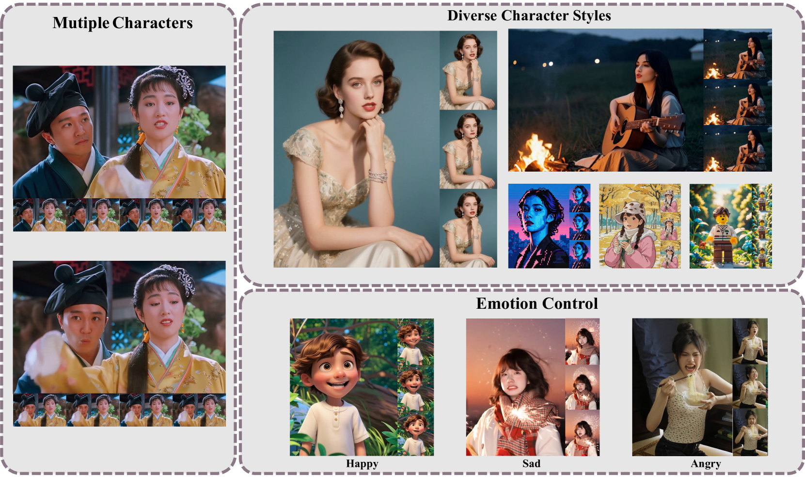

# HunyuanVideo-Avatar: 高保真音频驱动多角色人物动画论文汇报

## 1. 论文概述

### 1.1 基本信息
- **论文标题**: HunyuanVideo-Avatar: High-Fidelity Audio-Driven Human Animation for Multiple Characters
- **发表时间**: 2025年5月26日 (arXiv:2505.20156)
- **研究机构**: 腾讯混元团队
- **主要作者**: Yi Chen, Sen Liang, Zixiang Zhou 等



**Figure 1**：HunyuanVideo-Avatar可以使用角色图像和音频作为输入生成视频，能够创建多角色、高度一致且动态的人物动画，准确反映音频中表达的情感。

### 1.2 研究背景与动机
音频驱动人物动画在近年来取得显著进展，但仍面临三个关键挑战：
1. **动态性与一致性平衡**: 生成高度动态视频的同时保持角色一致性
2. **情感对齐精度**: 实现角色与音频间的精确情感对齐
3. **多角色支持**: 支持多角色音频驱动动画近年来取得显著进展，但仍面临三个关键挑战：

## 2. 核心技术创新

### 2.1 整体架构设计

HunyuanVideo-Avatar基于**多模态扩散Transformer (MM-DiT)**架构，采用**Flow Matching**作为扩散框架：


**Figure 2**：HunyuanVideo-Avatar的完整框架图，包含三个核心组件：(1) Character Image Injection Module确保角色高一致性同时保持高动态性；(2) Audio Emotion Module将视频中角色的面部表情与音频中的情感对齐；(3) Face-aware Audio Adapter实现音频驱动的多角色控制。

### 2.2 核心创新模块深度解析

#### 2.2.1 Character Image Injection Module (身份图像注入模块)

**问题分析**：传统方法直接将身份特征与噪声做element-wise addition，存在语义不对齐问题：
- `t_r`（重复的身份图像token）：静态人脸特征
- `t_noise`（视频噪声token）：动态运动信息

**解决方案**：引入Projection层实现语义对齐
$$\text{身份图像} \rightarrow \text{Projection层} \rightarrow \text{语义对齐} \rightarrow \text{与视频特征融合}$$

**技术细节**：
- 通过线性/非线性变换对附属token进行投影
- 解决训练与推理阶段的条件不匹配问题
- 确保动态运动与强角色一致性的平衡


**Figure 3**：三种不同的Character Image Injection Module设计方案。机制(c)表现最佳，通过将参考图像重复T次并通过投影模块直接添加到视频潜在表示中，在保证角色一致性的同时显著提升动态性。

#### 2.2.2 改进的RoPE位置编码

**原始HunyuanVideo RoPE**：
$$RoPE(l,i,j) - \text{直接对视频每帧每像素位置编码}$$

**身份信息传播的创新RoPE**：
$$RoPE_{zI}(l,i,j) = RoPE(-1, i+w, j+h)$$

**设计原理深度解析**：

| 维度 | 设计 | 作用机制 |
|------|------|----------|
| **时间维度** | -1（虚拟帧） | 将身份图像放在视频时间轴之前，作为全局参考 |
| **空间偏移** | i+w, j+h | 防止模型简单复制粘贴，w和h为tensor，每像素偏移不同 |

**形象理解**：
1. **身份图像**：像"身份证照片"，放在时间轴最前面
2. **空间偏移**：像给照片"加扰动"，避免直接抄袭
3. **时间传播**：整个视频制作过程中持续参考身份信息

**与原始3D RoPE的协同工作**：

| 编码类型 | 作用 | 时间维度 | 空间维度 | 主要贡献 |
|---------|------|----------|----------|----------|
| **原始3D RoPE** | 视频时空结构 | 连续帧序列(0,1,2...) | 原始位置(i,j) | 时间一致性、空间结构 |
| **RoPE_zI** | 身份信息传播 | 固定参考(-1) | 偏移位置(i+w,j+h) | 身份一致性、防止复制 |

#### 2.2.3 Face-Aware Audio Adapter (FAA)

**多角色挑战**：如何在多角色场景中实现独立的音频驱动？


**FAA架构说明**：Face-Aware Audio Adapter通过潜空间面部掩码实现多角色独立控制，确保音频信息只影响指定角色的面部区域，从而实现精确的多角色音频驱动动画。

**核心数学设计**：音频-视频时间对齐的精巧数学关系

给定原始音频-视频序列包含`n'`帧，经过3D VAE时间压缩后得到：
$$n = \lfloor n'/4 \rfloor + 1$$

其中：
- `⌊n'/4⌋`：压缩后的有效视频帧数（压缩比=4）
- `+1`：额外的初始未压缩帧

**音频Padding的数学对齐策略**：

为确保音频特征与视频latent的完美时间对齐，音频序列被padding成$(n+1) \times 4$帧：

$$\text{原始音频帧: } n'$$
$$\text{视频latent帧: } n+1 = \lfloor n'/4 \rfloor + 1 + 1$$
$$\text{音频padding: } (n+1) \times 4 = (\lfloor n'/4 \rfloor + 2) \times 4$$

**精确对齐机制**：

| 视频Latent帧索引 | 含义 | 对应音频帧索引 | 音频内容类型 | 数学对齐原理 |
|----------------|------|--------------|-------------|-------------|
| 0 | Identity图像 | 0-3 | Padding音频 | 身份信息无需音频驱动 |
| 1 | 原始首帧（未压缩） | 4-7 | Padding音频 | 提供pose基准，无需音频驱动 |
| 2 | 压缩帧1 | 8-11 | 有效语音1 | 4:1压缩对应关系 |
| 3 | 压缩帧2 | 12-15 | 有效语音2 | 4:1压缩对应关系 |
| ... | ... | ... | ... | ... |
| n | 压缩帧(n-1) | 4×n-3 到 4×n | 有效语音(n-1) | 完美时间对齐 |

**解决方案核心思想**：
1. **潜空间人脸掩码**：在latent level隔离音频驱动的角色
2. **交叉注意力机制**：为每个角色独立注入音频信息
3. **数学精确对齐**：通过$(n+1) \times 4$ padding确保音频-视频完美同步

**关键洞察**：为什么这种对齐设计如此重要？
- **数学严格性**：保证identity帧和未压缩首帧对应无意义padding音频
- **语义一致性**：其他latent特征与有意义音频特征一一对齐
- **时间同步**：避免音频-视频时间偏移导致的唇形不同步
- **计算效率**：批量处理4帧音频对应1帧视频的映射关系

**特征变化的完整数学描述**：

首先，将音频特征重新排列以匹配视频latent结构：
$$g_A = \text{Rearrange}(g_{A,0}): [b, (n+1) \times 4, 10, d] \rightarrow [b, (n+1), 40, d] \quad \text{(Eq.4)}$$

然后，通过空间交叉注意力机制注入音频信息：
$$y_{t,A}' = \text{Rearrange}(y_t): [b, (n+1)wh, d] \rightarrow [b, n+1, wh, d] \quad \text{(Eq.5a)}$$
$$y_{t,A}'' = y_{t,A}' + \alpha_A \times \text{CrossAttn}(g_A, y_t') \times g_M \quad \text{(Eq.5b)}$$
$$y_{t,A} = \text{Rearrange}(y_{t,A}''): [b, n+1, wh, d] \rightarrow [b, (n+1)wh, d] \quad \text{(Eq.5c)}$$

其中：
- $\alpha_A$：控制音频特征影响强度的可学习权重
- $g_M$：面部掩码，确保音频只影响指定角色的面部区域
- $\text{CrossAttn}(g_A, y_t')$：音频特征作为Key/Value，视频特征作为Query的交叉注意力

#### 2.2.4 Audio Emotion Module (音频情感模块)

**核心挑战**：如何实现音频情感与角色面部表情的精确对齐？


**AEM架构说明**：Audio Emotion Module通过情感参考图像引导，将情感特征通过FC层和空间交叉注意力机制注入到视频latent中，实现音频情感与角色面部表情的精确对齐。

**解决方案**：通过情感参考图像引导的交叉注意力机制

**技术实现流程**：
1. **情感特征编码**：$E_{ref} = \text{Encoder}(I_{ref})$
2. **特征注入**：将情感特征通过FC层和空间交叉注意力注入到视频latent中
3. **情感传递**：确保生成的角色表情与音频情感保持一致

**特征变化的完整数学描述**：

$$y_{t,A}' = \text{Rearrange}(y_{t,A}): [b, (n+1)wh, d] \rightarrow [b, n+1, wh, d] \quad \text{(Eq.6a)}$$
$$y_{t,A,E}'' = y_{t,A}' + \gamma_E \times \text{CrossAttn}(\text{FC}(E_{ref}), y_{t,A}') \quad \text{(Eq.6b)}$$
$$y_{t,A,E} = \text{Rearrange}(y_{t,A,E}''): [b, n+1, wh, d] \rightarrow [b, (n+1)wh, d] \quad \text{(Eq.6c)}$$

其中：
- $\gamma_E$：可学习的缩放因子，控制情感参考特征对视频latent的影响强度
- $\text{FC}(E_{ref})$：通过全连接层处理的情感参考特征，作为Key和Value
- $y_{t,A}'$：重排列后的视频latent特征，作为Query

**关键技术洞察**：
- **Double Block的重要性**：实验发现，将此模块插入Single Block无法有效学习情感线索，而集成到Double Block中能够更好地驱动和表达角色情感
- **情感传递机制**：通过FC层将情感参考图像特征转换为适合交叉注意力的表示
- **精确控制**：$\gamma_E$参数允许动态调整情感强度，实现细粒度情感控制

#### 2.2.5 Long Video Generation (长视频生成)

**技术挑战**：HunyuanVideo-13B模型只能生成129帧视频，通常短于音频长度

**解决方案**：采用Time-aware Position Shift Fusion方法

**核心算法**：

```python
Algorithm 1: Long Video Fusion

Input: 
- Audio embedding v_a[0,l] with length l
- Denoising steps T
- Initial noisy latent z_T[0,l]
- Pretrained HunyuanVideo-Avatar model HVA(·) for sequence length f
- Position-shift offset α < f < l

Output: 
- Denoised latent z_0[0,l]

Process:
1: Initialize accumulated shift offset α_β = 0
2: for t = T, ..., 1 do  // Denoising loop
3:     Initialize start point s = α_β, end e = α_β + f
4:     if e > l then
5:         e = l, s = l - f  // Handle boundary case
6:     end if
7:     Extract audio segment v_a[s:e]
8:     Extract latent segment z_t[s:e]
9:     Apply denoising: z_{t-1}[s:e] = HVA(z_t[s:e], v_a[s:e], t)
10:    Update shift: α_β = α_β + α
11: end for
12: return z_0[0,l]
```

**算法设计原理**：

| 参数 | 作用 | 取值范围 | 设计考虑 |
|------|------|----------|----------|
| **α (offset)** | 每次时间步的前进步长 | 3-7 | 平衡连续性和计算效率 |
| **f** | 单次处理的序列长度 | 129帧 | 受模型架构限制 |
| **重叠策略** | 前一段的结尾与后一段开头重叠 | α步重叠 | 确保时间连续性 |

**关键技术优势**：
1. **零额外成本**：不增加推理或训练开销
2. **减少视频瑕疵**：有效减少抖动和突变
3. **自然过渡**：通过位置偏移实现平滑连接
4. **音频同步**：保持整个长视频的音频-视觉同步

## 3. 技术深度分析

### 3.1 Flow Matching vs DDPM

HunyuanVideo-Avatar选择Flow Matching作为扩散框架：

| 特性 | Flow Matching | DDPM |
|------|---------------|------|
| **采样方式** | ODE采样 | SDE采样 |
| **采样步数** | 10-50步 | 1000步 |
| **确定性** | ✅ 完全确定 | ❌ 随机性 |
| **训练稳定性** | ✅ 学习直线路径 | ❌ 复杂扩散过程 |
| **推理速度** | ⭐⭐⭐⭐⭐ | ⭐ |

**选择原因**：
- 视频生成需要高效推理
- 直线路径学习更适合复杂的多模态条件
- 确定性输出有利于一致性控制

### 3.2 语义对齐的重要性

**问题根源**：
$$\text{静态身份特征} + \text{动态运动噪声} = \text{语义冲突}$$

**传统方法的问题**：
- 直接addition假设特征在同一语义空间
- 忽略了静态与动态特征的本质差异
- 导致身份信息丢失或动作不自然

**HunyuanVideo-Avatar的解决方案**：
$$\text{身份特征} \rightarrow \text{Projection} \rightarrow \text{对齐语义空间} \rightarrow \text{融合}$$

### 3.3 多模态条件融合策略


## 4. 实验结果与分析

### 4.1 主要贡献验证

1. **身份一致性**：Character Image Injection Module显著提升角色一致性
2. **动态表现**：改进的RoPE编码支持更丰富的动作表达
3. **多角色支持**：FAA成功实现多角色独立控制
4. **情感精确性**：Audio Emotion Module实现细粒度情感控制


**Figure 4**：在HDTF数据集上与现有方法的定性比较，HunyuanVideo-Avatar生成的视频在视觉质量、面部表情自然度和美学效果方面均优于Sonic、EchoMimic、EchoMimicV2和Hallo-3等方法。


**Figure 5**：HunyuanVideo-Avatar在野生数据集上的生成结果展示，演示了模型在各种风格角色、情感控制和音频驱动多角色场景下的有效性。


**Figure 6**：在野生全身数据集上与Hallo3、FantasyTalking和OmniHuman-1的定性比较，HunyuanVideo-Avatar在前景、背景和角色运动的自然变化以及唇形同步和角色一致性方面表现更优。

### 4.2 与SOTA方法对比

HunyuanVideo-Avatar在以下方面超越现有方法：
- **生成质量**：更高的视觉保真度
- **身份保持**：更好的角色一致性
- **动作自然度**：更流畅的动作转换
- **多角色能力**：首次实现高质量多角色驱动


**Figure 7**：(a) Audio Emotion Module的消融实验，展示了情感参考图像对角色面部情感表达的影响；(b) Face-Aware Audio Adapter的消融实验，演示了面部掩码在多角色音频驱动中的关键作用。

## 5. 技术洞察与未来展望

### 5.1 关键技术洞察

1. **条件对齐的重要性**：不同模态条件必须在相同语义空间融合
2. **位置编码的巧妙设计**：通过虚拟帧和空间偏移实现身份传播
3. **多粒度控制策略**：从全局身份到局部表情的层次化控制
4. **效率与质量平衡**：Flow Matching为视频生成提供最佳平衡

### 5.2 技术局限性

1. **计算复杂度**：多模态条件融合增加计算开销
2. **数据依赖性**：需要高质量的多模态训练数据
3. **泛化能力**：对于训练集外的身份可能存在泛化问题

### 5.3 未来发展方向

1. **实时生成**：进一步优化推理速度，实现实时应用
2. **更多模态**：集成手势、肢体语言等更多控制信号
3. **个性化定制**：支持用户个性化的角色创建和控制
4. **交互式应用**：开发面向实际应用的交互式系统

## 6. 总结

HunyuanVideo-Avatar通过三个核心创新解决了音频驱动人物动画的关键挑战：

1. **Character Image Injection Module**：解决身份一致性与动态性的平衡
2. **改进的RoPE编码**：实现有效的身份信息传播
3. **Face-Aware Audio Adapter**：支持多角色独立控制

这些技术创新不仅推动了音频驱动动画领域的发展，也为未来的多模态视频生成提供了重要的技术参考。论文在理论创新和实际应用之间找到了良好的平衡点，代表了当前该领域的最高水平。

## 7. 更多可视化结果

### 7.1 多角色场景应用


**Figure 8**：展示HunyuanVideo-Avatar在相声、唱歌和行走对话等多角色场景中的生成效果，证明了模型的鲁棒性和实用性。

### 7.2 真实场景应用


**Figure 9**：HunyuanVideo-Avatar在真实人物图像上的应用效果，展示了模型在保持角色一致性的同时增强动态性的能力，进一步验证了Character Image Injection Module的有效性。

### 7.3 多样风格角色


**Figure 10**：HunyuanVideo-Avatar在各种风格角色上的生成结果，包括乐高、中国画、动漫和铅笔素描等，展示了方法的良好泛化能力。

### 7.4 精确情感控制


**Figure 11**：HunyuanVideo-Avatar实现的精确情感控制效果，模型能够很好地理解和表达快乐、悲伤、兴奋和愤怒等不同情感，生成与音频情感更好对齐的人物动画视频。

---

**参考文献**：
- Chen, Y., et al. "HunyuanVideo-Avatar: High-Fidelity Audio-Driven Human Animation for Multiple Characters." arXiv preprint arXiv:2505.20156 (2025).
