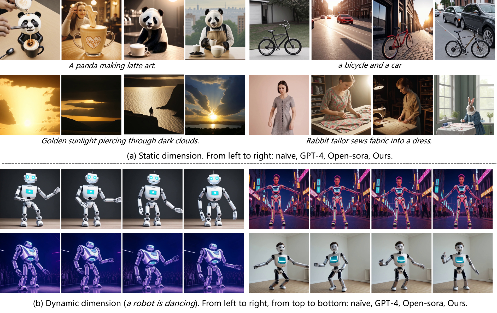

# RAPO: 基于检索增强的提示词优化框架

## 论文信息
- **标题**: Prompt Optimization via Dual-path Alignment for Text-to-Video Generation
- **arXiv**: 2504.11739v2
- **作者**: [作者信息需从原文获取]
- **关键词**: Text-to-Video, Prompt Optimization, Retrieval-Augmented, LLM Fine-tuning

---

## 1. 研究背景与动机


*图1: LaVie模型在用户原始prompt和RAPO优化prompt下的生成效果对比。优化后的prompt显著提升了视频的静态质量和动态表现。*

### 1.1 Text-to-Video 生成的现状
- **进展**: 扩散模型推动了 T2V 生成技术快速发展
- **应用**: 动画生成、电影制作、教育演示等广泛应用
- **挑战**: 模型对输入 prompt 高度敏感，生成质量严重依赖提示词设计

### 1.2 核心问题
#### 用户 Prompt vs 训练 Prompt 的分布不匹配
- **用户输入**: 
  - 过于简短："a cat sleeping"
  - 缺乏必要细节
  - 句式结构不规范
  
- **训练数据**:
  - 详细且结构化："A fluffy orange cat is peacefully sleeping on a comfortable sofa in a warm living room with soft lighting"
  - 包含丰富的修饰词（modifiers）
  - 格式统一，长度适中

#### 现有解决方案的局限
1. **直接 LLM 改写**: 容易语义漂移，生成过长或不相关内容
2. **T2I 方法迁移**: 忽略视频的时间维度特性
3. **缺乏训练分布对齐**: 未考虑与训练 prompt 的格式一致性

---

## 2. RAPO 框架总览


*图2: RAPO框架总体架构图。展示了双路径优化策略：路径一通过关系图增强和句式重构，路径二通过直接LLM改写，最后通过判别器选择最优结果。*

### 2.1 核心设计思想
RAPO (Retrieval-Augmented Prompt Optimization) 采用**双路径优化**策略：

#### 路径一：图结构增强 + 句式重构
1. **Word Augmentation**: 基于关系图检索相关修饰词
2. **Sentence Refactoring**: 用微调 LLM 重构句式结构

#### 路径二：直接 LLM 改写
- 使用预训练 LLM + 指令模板直接改写

#### 判别选择
- **Prompt Selection**: 训练判别器 LLM 选择最优 prompt

### 2.2 系统流程
```
用户 Prompt → 双路径优化 → 判别器选择 → 最终优化 Prompt → T2V 模型
```

---

## 3. 核心技术模块详解

### 3.1 Word Augmentation Module (词增强模块)

#### 3.1.1 Relation Graph 构建

*图3: 关系图的构建过程。从训练数据中提取场景和修饰词，构建以场景为核心节点、修饰词为子节点的图结构。*

**构建流程**:
1. **数据预处理**: 从 Vimeo25M 训练集提取 2.1M 有效 prompt
2. **信息抽取**: 使用 Mistral LLM 提取：
   - **Scene**: 核心场景描述
   - **Subject modifiers**: 主体修饰词
   - **Action modifiers**: 动作修饰词  
   - **Atmosphere modifiers**: 氛围修饰词
3. **图结构**: Scene 作为核心节点，连接相关 modifiers

**示例**:
```
Scene: "a man dancing in the rain"
├── Subject: "a young man", "a man in suit"
├── Action: "dancing passionately", "spinning around"
└── Atmosphere: "in heavy rain", "under streetlights"
```

#### 3.1.2 检索机制
**两阶段检索**:
1. **Scene 检索**: 
   - 使用 sentence-transformer 计算语义相似度
   - 选择 top-k 相似 scene
2. **Modifier 检索**:
   - 收集相关 scene 下的所有 modifiers
   - 再次计算相似度，选择 top-k modifiers

#### 3.1.3 LLM 合并机制
使用 frozen LLM 逐步合并 modifier：
```python
x_i^{m+1} = f(x_i^m, p_i^m)  # m = 0,1,...,k-1
```

**合并模板**:
- 输入：原始描述 + 修饰词
- 输出：自然融合的增强描述
- 示例：
  - 原始："a woman representing a funeral"
  - 修饰词："a black suit"
  - 合并："a woman dressed in a black suit representing a funeral"

### 3.2 Sentence Refactoring Module (句式重构模块)

#### 3.2.1 训练数据构建
构建 prompt 对数据集：
```
D_r = {r_i = (w_i, c_i)}
```
- **w_i**: 模拟词增强后的松散 prompt
- **c_i**: 训练集中的标准 prompt

**数据合成策略**:
1. 从训练 prompt c_i 开始
2. 用 LLM 指令将其"打乱"成非规范格式 w_i
3. 构造 (w_i, c_i) 训练对

#### 3.2.2 Instruction Tuning
微调 LLM L_r 学习格式重构：

**指令模板**:
```
Instruction: Refine format and word length of the sentence: {w_i}
Maintain the original subject descriptions, actions, scene descriptions.
Append additional straightforward actions to make the sentence more dynamic if necessary.
Output: {c_i}
```

**效果**: 将语义丰富但结构松散的 prompt 转换为格式统一、长度适中的标准 prompt

### 3.3 Prompt Selection Module (选择模块)

#### 3.3.1 训练数据构建
构建三元组数据：
```
D_d = {d_i = (x_i, x_r, x_n, y_d)}
```
- **x_i**: 用户原始 prompt
- **x_r**: RAPO 优化结果
- **x_n**: 直接 LLM 改写结果
- **y_d**: 判别标签（哪个更优）

#### 3.3.2 自动评价机制
**评价维度自动选择**:
1. 使用 LLM 分析 prompt 内容
2. 自动确定评价维度（动作质量、多目标、场景复杂度等）
3. 选择对应评价指标
4. 对两个优化结果的生成视频进行评分
5. 生成判别标签

#### 3.3.3 判别器训练
微调判别器 LLM L_d：
```
Instruction: Given user-provided prompt x_i, select the better optimized prompt from x_r and x_n.
The chosen prompt is required to contain multiple, straightforward, and relevant modifiers about x_i while involving the semantics of x_i.
Output: discriminator label y_d
```

---

## 4. 实验设计与结果

### 4.1 实验设置

#### 4.1.1 评估基准
- **VBench**: 16 个细粒度维度的系统评估
- **EvalCrafter**: 17 个客观指标的综合评估
- **T2V-CompBench**: 复杂组合场景的专门评估

#### 4.1.2 对比方法
- **Short prompt**: 用户原始短 prompt
- **GPT-4**: GPT-4 优化的 prompt
- **Open-sora**: Open-Sora 的 prompt refiner
- **RAPO**: 本文方法

#### 4.1.3 测试模型
- **LaVie**: 基于扩散模型的 T2V 生成器
- **Latte**: 基于 DiT 架构的 T2V 生成器

### 4.2 定性结果分析


*图4: 不同方法的定性比较结果。展示了在相同用户prompt下，RAPO优化后的视频在空间细节和时间一致性方面的显著改善。*

**关键观察**:
1. **用户原始 prompt**: 生成视频细节不足，动作不连贯
2. **GPT-4/Open-sora**: 虽然增加了细节，但可能引入无关信息
3. **RAPO**: 在保持语义一致性的同时，显著提升视频质量

### 4.3 定量结果分析

#### 4.3.1 VBench 评估结果
| 模型 | Total Score | Multiple Objects | Object Class | Spatial Relationship |
|------|-------------|------------------|--------------|---------------------|
| LaVie | 80.89% | 37.71% | 92.09% | 37.27% |
| LaVie-GPT4 | 79.69% | 36.23% | 88.73% | 50.55% |
| LaVie-Open-sora | 79.75% | 36.52% | 91.29% | 54.37% |
| **LaVie-RAPO** | **82.38%** | **64.86%** | **96.91%** | **59.15%** |

**关键提升**:
- Multiple Objects: 37.71% → 64.86% (+27.15%)
- Object Class: 92.09% → 96.91% (+4.82%)
- 总体得分: 80.89% → 82.38% (+1.49%)

#### 4.3.2 多目标生成分析

**发现**:
1. **空间关系描述**的加入显著改善多目标生成
2. RAPO 自动检索并添加相关空间修饰词
3. 避免了 CLIP 文本编码器的信息融合问题

### 4.4 Prompt 长度分布分析

**统计发现**:
- **用户 prompt**: 过短，信息不足
- **GPT-4/Open-sora**: 过长，可能包含冗余信息
- **RAPO**: 长度分布最接近训练数据，实现最佳对齐

### 4.5 消融实验

#### 4.5.1 模块贡献分析
| 配置 | Word Aug | Refactoring | Selection | VBench Score |
|------|----------|-------------|-----------|--------------|
| (a) | ✓ | | | 80.37% |
| (b) | | ✓ | | 79.75% |
| (c) | ✓ | ✓ | | 81.58% |
| (d) | | ✓ | ✓ | 81.75% |
| (e) | ✓ | | ✓ | 80.60% |
| **(f)** | **✓** | **✓** | **✓** | **82.38%** |

**结论**: 每个模块都有贡献，三者协同效果最佳

#### 4.5.2 LLM 选择对比
| LLM | VBench Score |
|-----|--------------|
| GPT-4 | 82.38% |
| Mistral | 82.25% |
| LLaMA 3.1 | 82.10% |

**结论**: RAPO 框架对不同 LLM 具有良好的鲁棒性

---

## 5. 技术创新点

### 5.1 方法论创新
1. **双路径设计**: 结合检索增强与直接改写的优势
2. **训练分布对齐**: 显式考虑与训练 prompt 的格式一致性
3. **自动评价维度选择**: 根据 prompt 内容智能选择评价指标

### 5.2 工程实现创新
1. **关系图构建**: 从训练数据中学习语义共现模式
2. **渐进式合并**: 逐步增强避免语义偏移
3. **端到端判别**: 自动选择最优结果，减少人工干预

### 5.3 应用价值
1. **即插即用**: 可应用于现有 T2V 模型而无需重训练
2. **鲁棒性强**: 对不同 LLM 和 T2V 模型都有效果
3. **显著提升**: 在多个基准上都有明显改进

---

## 6. 局限性与未来工作

### 6.1 当前局限性
1. **计算开销**: 需要维护关系图和多个 LLM 模块
2. **领域依赖**: 关系图质量依赖训练数据的覆盖度
3. **语言限制**: 主要针对英文 prompt 设计

### 6.2 未来研究方向
1. **扩展到更多 T2V 模型**: 验证框架的通用性
2. **多语言支持**: 构建多语言关系图
3. **在线学习**: 动态更新关系图以适应新场景
4. **效率优化**: 减少推理时间和内存占用

---

## 7. 结论

RAPO 提出了一个全新的 prompt 优化框架，通过：

1. **检索增强的词汇补全**: 基于训练数据构建的关系图
2. **结构化的句式重构**: 确保与训练分布对齐
3. **智能的结果选择**: 自动判别最优优化结果

在多个基准测试中显著提升了 T2V 生成质量，特别是在多目标场景生成方面取得了突破性进展。

该框架具有良好的通用性和鲁棒性，为 T2V 生成领域的 prompt 优化提供了新的技术路径和实践指导。

---

## 8. 技术实现要点

### 8.1 关键数据规模
- **训练数据集**: Vimeo25M (2500万文本-视频对)
- **有效Prompt**: 从中筛选2.1M条用于构建关系图
- **Refactor训练数据**: 86K个prompt对
- **Discriminator训练数据**: 7K个三元组样本
- **图节点规模**: 约100万个scene节点，平均每个节点连接8-12个modifier

### 8.2 模型配置
- **基础LLM**: LLaMA 3.1
- **微调方法**: LoRA (rank=64)
- **训练硬件**: 单张A100 GPU
- **训练时间**: Refactor模型8个epoch，Discriminator模型3个epoch
- **推理速度**: 单个prompt优化耗时约2-3秒

### 8.3 性能基准
- **VBench总分提升**: 80.89% → 82.38%
- **多目标生成**: 提升超过27个百分点
- **文本-视频对齐**: EvalCrafter分数提升约5分
- **组合场景理解**: T2V-CompBench多项指标显著提升

---

## 9. 汇报总结

### 9.1 论文核心贡献
1. **首次提出**针对T2V的检索增强prompt优化框架
2. **系统解决**了用户prompt与训练prompt分布不匹配问题
3. **显著提升**了多目标、复杂场景的视频生成质量
4. **验证有效**的双路径设计和自动判别机制

### 9.2 技术创新价值
- **方法论**: 将检索增强思想引入prompt优化领域
- **工程性**: 提供了完整的、可复现的技术方案
- **通用性**: 适用于不同的T2V模型和LLM后端
- **实用性**: 即插即用，无需重训练T2V模型

### 9.3 实验验证强度
- **多基准评估**: VBench、EvalCrafter、T2V-CompBench
- **多模型验证**: LaVie、Latte等不同架构
- **充分的消融实验**: 验证每个模块的贡献
- **定性定量结合**: 全面展示改进效果

### 9.4 应用前景
- **产业应用**: 可直接部署到现有的T2V生成系统
- **研究启发**: 为其他生成任务的prompt优化提供思路  
- **技术演进**: 推动T2V领域向更高质量方向发展

---

## 10. Q&A 预期问题

### Q1: RAPO相比直接使用GPT-4优化有什么优势？
**A**: RAPO的优势在于：
1. **分布对齐**: 明确与训练数据分布对齐，而GPT-4可能生成偏离训练分布的内容
2. **结构控制**: 通过关系图约束和重构模块，确保prompt格式一致性
3. **语义保真**: 基于训练数据的检索增强，避免LLM的幻觉问题
4. **自动选择**: 判别器能自动选择最优结果，提升系统鲁棒性

### Q2: 关系图的构建是否会限制创造性？
**A**: 不会，原因是：
1. **检索是增强不是限制**: 图检索提供候选modifier，LLM仍可自由组合
2. **覆盖面广**: 2.1M训练prompt构建的图具有丰富的语义覆盖
3. **双路径设计**: 保留直接LLM改写路径，确保创造性不受限
4. **渐进式合并**: 逐步添加modifier，保持语义自然性

### Q3: 系统的计算开销如何？
**A**: 
1. **离线构建**: 关系图一次性构建，后续只需检索
2. **高效检索**: 使用向量索引技术，检索速度很快
3. **模型轻量**: LoRA微调模型相对较小
4. **并行处理**: 双路径可以并行执行
5. **实际测试**: 单个prompt优化耗时2-3秒，可接受

### Q4: 如何保证在新领域的泛化能力？
**A**:
1. **大规模训练数据**: Vimeo25M覆盖多样化场景
2. **LLM通用能力**: 基于预训练LLM的强大泛化性
3. **模块化设计**: 可以针对新领域重新构建关系图
4. **实验验证**: 在多个不同的评估基准上都有提升

---

*汇报时间建议: 20-25分钟（根据提问调整）*
