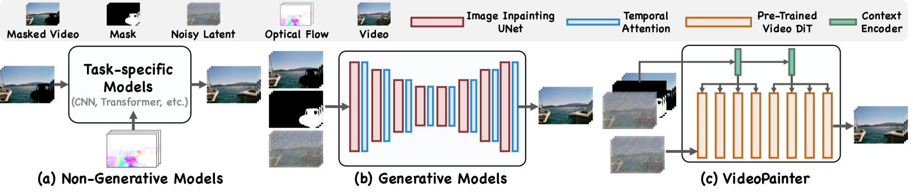
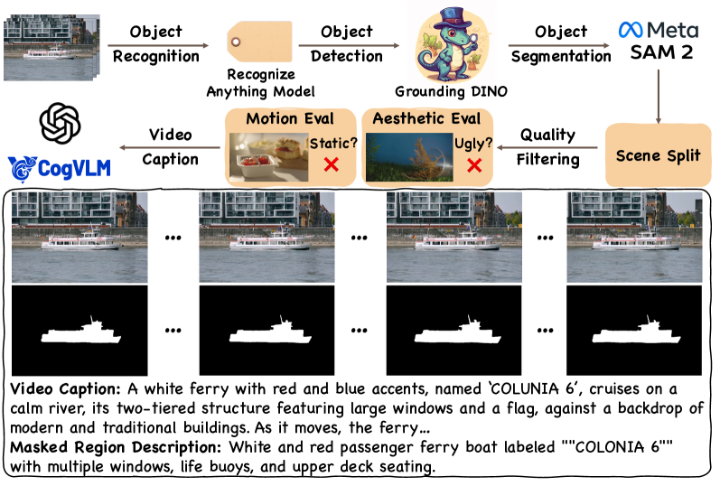
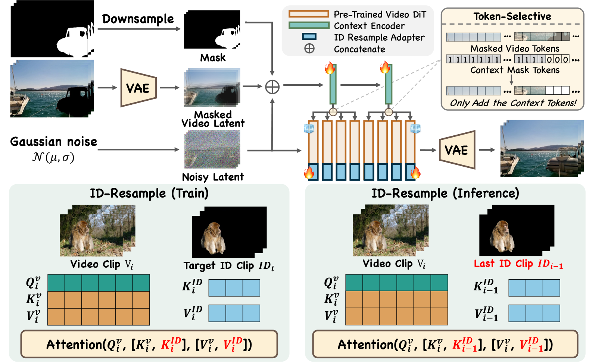
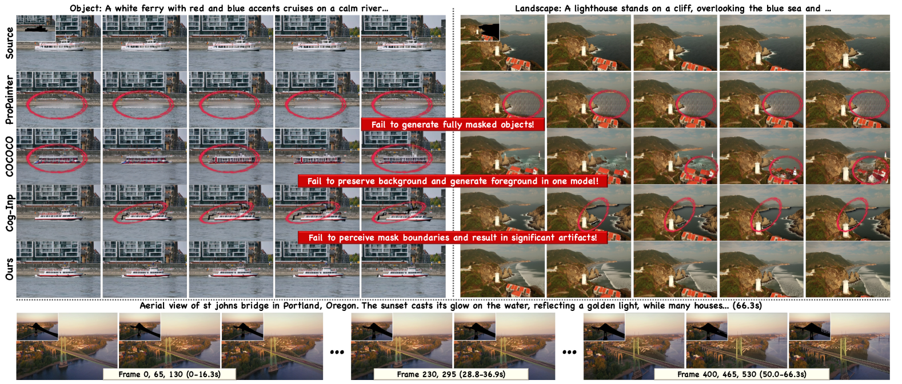
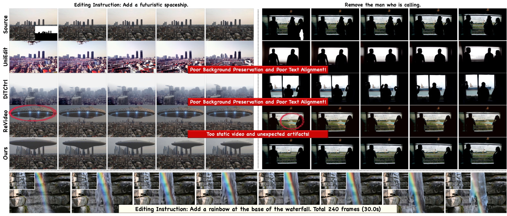
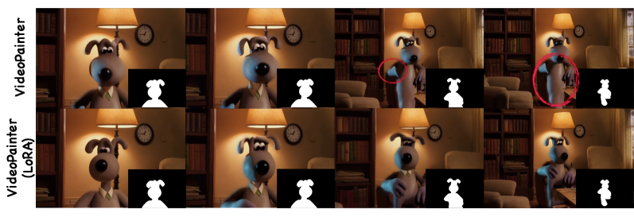

# VideoPainter: Any-length Video Inpainting and Editing with Plug-and-Play Context Control

**论文汇报**

---

## 目录

1. [研究背景与问题](#1-研究背景与问题)
2. [相关工作](#2-相关工作)
3. [本文贡献与创新点](#3-本文贡献与创新点)
4. [方法详解](#4-方法详解)
   - 4.1 [VPData/VPBench 数据集构建](#41-vpdatavpbench-数据集构建)
   - 4.2 [双分支架构设计](#42-双分支架构设计)
   - 4.3 [ID重采样机制](#43-id重采样机制)
   - 4.4 [平滑过渡策略](#44-平滑过渡策略)
   - 4.5 [即插即用控制](#45-即插即用控制)
5. [实验结果](#5-实验结果)
6. [总结与讨论](#6-总结与讨论)

---

## 1. 研究背景与问题

### 1.1 视频修复的重要性
- **应用场景**：影视制作、虚拟试衣、视频编辑等
- **核心任务**：恢复视频中的损坏或遮挡内容，同时保持时序连贯性

### 1.2 现有方法的局限性

**非生成式方法的问题**：
- 依赖像素传播，无法生成完全被遮挡的对象
- 仅适用于部分遮挡场景，遇到大面积缺失区域效果差

**生成式方法的问题**：
- 单分支架构难以平衡背景保持与前景生成
- 长视频中身份一致性差，容易出现"变脸"现象
- 时序连贯性不足，片段间存在视觉跳变


*图1：现有方法对比。非生成式方法无法修复完全遮挡区域，生成式方法难以平衡背景与前景*

---

## 2. 相关工作

### 2.1 视频修复方法分类

**非生成式方法**：
- ProPainter、AVID 等，基于光流和像素传播
- 优点：稳定性好，计算效率高
- 缺点：无法生成新内容，仅能"搬运"已有像素

**生成式方法**：
- COCOCO、VideoComposer 等，基于扩散模型
- 优点：可以生成完全遮挡的内容
- 缺点：背景保持差，长视频一致性不足

### 2.2 数据集现状
- 现有数据集（DAVIS、YouTube-VOS）规模小（<5K clips）
- 缺乏文本标注，无法支持可控生成
- 本文构建的 VPData：390K clips，866.7小时，是目前最大的视频修复数据集

---

## 3. 本文贡献与创新点

### 3.1 四大核心贡献

1. **首个双分支视频修复框架**
   - 解耦背景保持与前景生成
   - 支持即插即用的背景控制

2. **轻量级上下文编码器设计**
   - 仅占主干参数的6%
   - 高效的背景控制与ID一致性维护

3. **大规模数据集构建**
   - VPData：390K视频片段，精确掩码+密集文本描述
   - VPBench：专业评测基准

4. **SOTA性能表现**
   - 8项指标全面领先
   - 支持任意长度视频修复与编辑

### 3.2 技术创新亮点
- **背景-前景解耦**：双分支架构避免单分支的目标冲突
- **身份一致性保障**：ID重采样机制维护长视频目标身份
- **任意长度支持**：平滑过渡策略实现无缝片段衔接
- **高扩展性**：即插即用框架支持多种主干网络

---

## 4. 方法详解

### 4.1 VPData/VPBench 数据集构建


*图2：数据集构建流程*

#### 4.1.1 五步构建流程

**1. 数据收集（Collection）**
- 来源：Videvo、Pexels 等公开视频平台
- 规模：约45万段原始视频

**2. 自动标注（Annotation）**
- **目标识别**：Recognize Anything Model (RAM) 识别物体类别
- **目标检测**：Grounding DINO 生成 bounding boxes
- **掩码分割**：SAM2 生成高质量像素级掩码
- **质量筛选**：帧间掩码面积变化<20%，覆盖率30%-70%

**3. 场景分割（Splitting）**
- PySceneDetect 检测场景切换
- 按10秒分段，删除<6秒的短片段

**4. 样本筛选（Selection）**
- **审美质量**：Laion-Aesthetic Predictor
- **运动性评估**：RAFT 光流检测
- **内容安全**：Stable Diffusion Safety Checker

**5. 多模态描述生成（Captioning）**
- **整体描述**：CogVLM2/GPT-4o 生成视频caption
- **区域描述**：针对掩码区域的详细文本描述

#### 4.1.2 数据集特点
- **规模最大**：390K clips，866.7小时
- **标注丰富**：分割掩码 + 视频描述 + 区域描述
- **质量保证**：多重筛选机制确保数据质量

---

### 4.2 双分支架构设计


*图3：VideoPainter 模型架构概览*

#### 4.2.1 架构组成

**主干网络（Backbone）**：
- 冻结的预训练 Video DiT（CogVideo-5B-I2V）
- 负责前景内容的生成

**上下文编码器（Context Encoder）**：
- 仅复制 DiT 的前两层（参数量6%）
- 专门提取背景上下文特征

#### 4.2.2 输入处理

**三项输入拼接**：
$$\text{输入} = [z_t, z_{0}^{\text{masked}}, m_{\text{resized}}]$$
- $z_t$：当前时间步的噪声潜变量
- $z_{0}^{\text{masked}}$：VAE编码的带掩码视频潜变量
- $m_{\text{resized}}$：三次插值下采样的掩码

#### 4.2.3 特征融合机制

**分组注入（Group-wise Integration）**：
- Context Encoder 第1层 → DiT 前半部分
- Context Encoder 第2层 → DiT 后半部分

**令牌选择（Token-selective）**：
- 仅将"纯背景token"注入主干
- 排除前景区域token，避免语义混淆

数学公式：
$$\epsilon_\theta(z_t,t,C)_i = \epsilon_\theta(z_t,t,C)_i + \mathcal{Z}(\epsilon_{\text{VideoPainter}}([z_t,z_{0}^{\text{masked}},m_{\text{resized}}],t)_{i//n/2})$$

#### 4.2.4 设计优势
- **轻量高效**：仅6%额外参数实现双分支控制
- **解耦设计**：背景保持与前景生成相互独立
- **精准控制**：token选择机制避免信息冲突

---

### 4.3 ID重采样机制

#### 4.3.1 问题定义
- **身份漂移**：长视频中同一目标外观随时间变化
- **表现形式**：人物"换脸"、物体颜色/形状突变

#### 4.3.2 技术方案

**ID-Resample Adapter（基于LoRA）**：
- 冻结主干和Context Encoder
- 仅训练轻量级Adapter参数

**KV向量拼接机制**：
$$K' = \text{concat}(K_{\text{current}}, K_{\text{id}})$$
$$V' = \text{concat}(V_{\text{current}}, V_{\text{id}})$$
$$\text{Attention} = \text{softmax}(Q \cdot K'^T) \cdot V'$$

**训练与推理的差异**：
- **训练阶段**：使用当前片段掩码区域的identity tokens
- **推理阶段**：使用前一片段掩码区域的identity tokens

#### 4.3.3 工作原理
1. 从掩码区域提取包含身份信息的tokens
2. 通过Adapter投影为$K_{\text{id}}$、$V_{\text{id}}$
3. 拼接到主干Attention的K/V中
4. 让模型在生成时"记住"历史身份特征

---

### 4.4 平滑过渡策略

#### 4.4.1 长视频处理挑战
- **计算限制**：长视频无法一次性处理
- **片段分割**：必须分段处理，易产生边界跳变

#### 4.4.2 解决方案

**重叠生成与加权融合**：
- 相邻片段保留重叠区域（如2秒）
- 重叠帧通过加权平均融合前后片段结果
- 权重渐变：前片段权重逐渐降低，后片段权重逐渐升高

**前序帧锚定**：
- 前一片段的最后一帧作为当前片段重叠区域的起始帧
- 强制视觉外观连续性，避免背景、光照突变

#### 4.4.3 处理流程
```
Clip 1: 0-10秒
Clip 2: 8-18秒 (重叠8-10秒)
Clip 3: 16-26秒 (重叠16-18秒)
```

重叠区域处理：
- 8-9秒：前片段权重0.8，当前片段权重0.2
- 9-10秒：前片段权重0.2，当前片段权重0.8

---

### 4.5 即插即用控制

#### 4.5.1 多样化支持
- **风格化主干**：支持不同风格的预训练模型和LoRA
- **架构兼容**：同时支持T2V和I2V DiT架构

#### 4.5.2 I2V兼容实现
- 使用图像修复模型生成初始帧
- 初始帧作为图像条件和首个掩码帧
- 实现图像修复→视频生成的无缝衔接

#### 4.5.3 扩展性优势
- 无需重新训练即可切换主干
- 支持社区开发的风格化LoRA
- 降低使用门槛，提升实用性

---

## 5. 实验结果

### 5.1 实验设置
- **基础模型**：CogVideo-5B-I2V
- **训练配置**：学习率1e-5，Context Encoder训练80K步，ID Adapter训练2K步
- **评测基准**：VPBench（标准+长视频）、DAVIS

### 5.2 视频修复结果


*图4：视频修复效果对比*

**定量结果**：
- **VPBench标准视频**：PSNR 23.32，CLIP Sim 21.49，FVID 0.15
- **VPBench长视频**：PSNR 22.19，FVID 0.17
- **DAVIS随机掩码**：PSNR 25.27，SSIM 0.94

**性能优势**：
- 全面超越ProPainter、COCOCO、Cog-Inp
- 长视频修复优势更加显著

### 5.3 视频编辑结果


*图5：视频编辑效果对比*

**定量结果**：
- **标准视频**：PSNR 22.63，CLIP Sim 20.20，FVID 0.18
- **长视频**：PSNR 22.60，CLIP Sim 19.38，FVID 0.11

**显著优于**：UniEdit、DiTCtrl、ReVideo

### 5.4 消融实验

**关键发现**：
1. **双分支 vs 单分支**：PSNR提升2.78分，FVID降低0.07
2. **Context Encoder层数**：2层为最优平衡
3. **Token选择机制**：移除后CLIP Sim下降3.65分
4. **ID重采样**：长视频中PSNR提升0.4分

### 5.5 用户研究
- **30名参与者**评估50个案例
- **VideoPainter胜率**：
  - 视频修复：背景保留74.2%，文本对齐82.5%，视频质量87.4%
  - 视频编辑：背景保留78.4%，文本对齐76.1%，视频质量81.7%

### 5.6 即插即用能力验证


*图6：即插即用能力展示*

- 成功集成Gromit风格LoRA
- 跨域适应能力强（动画风格 vs 真实数据）

---

## 6. 总结与讨论

### 6.1 主要成就
1. **技术突破**：首个双分支视频修复框架，有效解耦背景与前景
2. **性能领先**：8项指标全面SOTA，用户研究验证主观优势
3. **数据贡献**：构建最大规模视频修复数据集VPData/VPBench
4. **实用价值**：支持任意长度视频，即插即用设计降低使用门槛

### 6.2 技术创新点总结

| 模块 | 创新点 | 作用 |
|------|--------|------|
| 双分支架构 | Context Encoder + 主干DiT | 解耦背景保持与前景生成 |
| ID重采样 | KV拼接机制 | 维护长视频身份一致性 |
| 平滑过渡 | 重叠融合+帧锚定 | 实现任意长度无缝衔接 |
| 即插即用 | 模块化设计 | 支持多种主干和风格 |

### 6.3 应用前景
- **影视制作**：大场景物体删除、背景替换
- **内容创作**：视频编辑、特效制作
- **数字媒体**：修复损坏视频、去除水印
- **虚拟现实**：沉浸式体验内容生成

### 6.4 局限性与未来工作
- **文本依赖**：生成质量受文本描述质量影响
- **计算开销**：长视频处理仍需较大计算资源
- **风格泛化**：特定风格下的适应性有待提升

**未来方向**：
- 结合更强的视觉-语言模型
- 优化长视频处理效率
- 扩展到更多模态和应用场景

---

### 6.5 结论

VideoPainter通过"数据-架构-机制-策略"四位一体的创新设计，显著提升了视频修复与编辑的质量、连贯性和可控性。其双分支架构有效解决了背景保持与前景生成的平衡问题，ID重采样机制和平滑过渡策略首次实现了任意长度视频的高质量修复，即插即用设计提供了强大的扩展性。实验结果表明，VideoPainter在多项指标上达到SOTA性能，为视频生成与编辑领域树立了新的技术标杆。

---

**参考文献**：Zhang et al., "VideoPainter: Any-length Video Inpainting and Editing with Plug-and-Play Context Control", arXiv:2503.05639v3, 2025.
