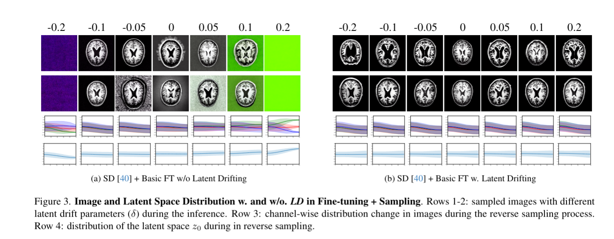
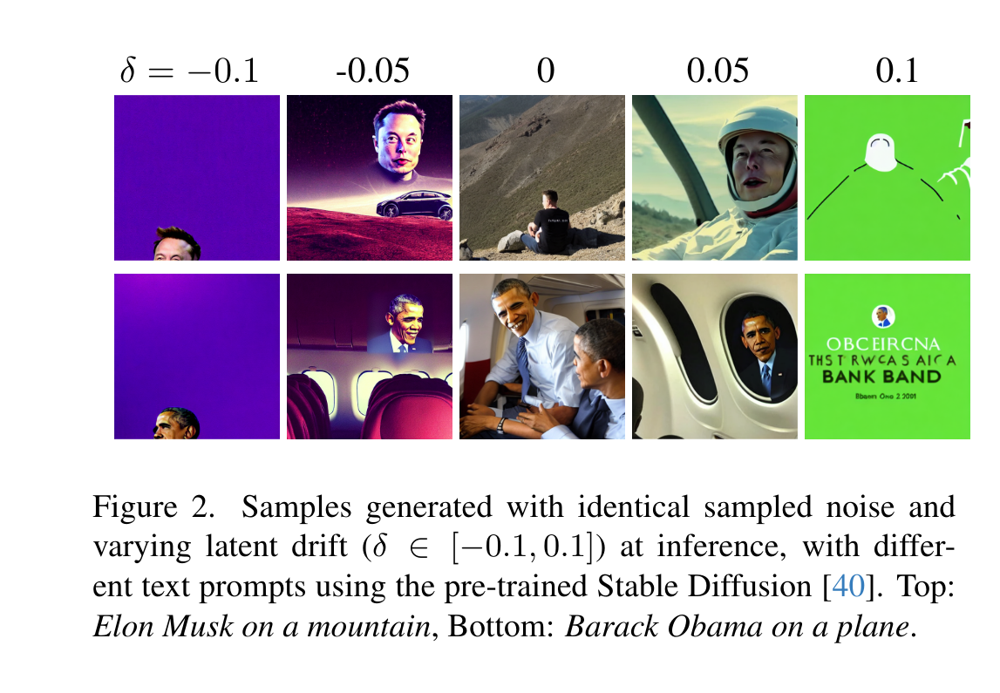
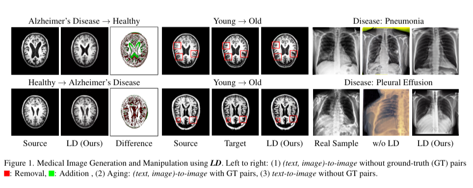
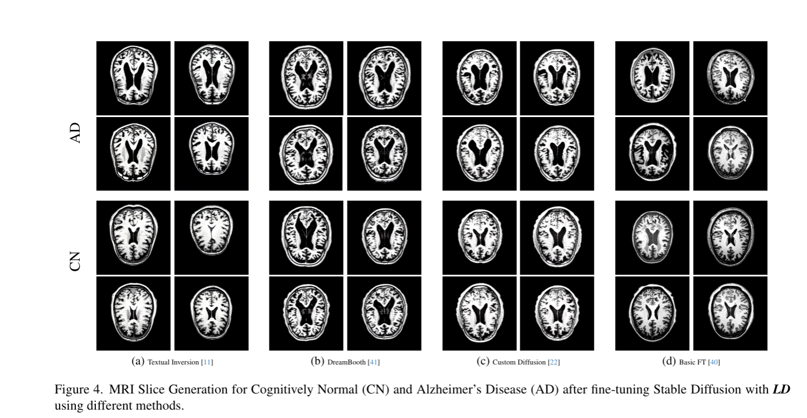

# Latent Drifting in Diffusion Models for Counterfactual Medical Image Synthesis

## 论文信息
- **标题**: Latent Drifting in Diffusion Models for Counterfactual Medical Image Synthesis
- **arXiv**: 2412.20651v2
- **发表时间**: 2024年12月

---

## 1. 研究背景与动机

### 1.1 问题背景
医疗图像领域面临的核心挑战：
- **数据稀缺性**: 医疗数据因隐私保护、采集成本高、罕见疾病样本少等因素难以大规模获取
- **分布偏移问题**: 预训练扩散模型(如Stable Diffusion)基于自然图像训练，与医疗图像存在显著分布差异
- **反事实生成需求**: 临床研究需要探索"如果患者性别、年龄、疾病状态改变，医学图像会如何变化"

### 1.2 现有方法的局限性
- **直接微调**: 由于分布差异巨大，效果不佳
- **从头训练**: 需要大量医疗数据，成本高且不现实
- **传统条件生成**: 缺乏对医疗领域特殊约束的考虑

### 1.3 研究目标
利用预训练扩散模型的强大能力，通过minimal的修改实现高质量的医疗图像反事实生成。

---

## 2. 核心方法：Latent Drifting (LD)

### 2.1 基本思想
Latent Drifting是一个**标量超参数δ**，通过对扩散模型潜在空间进行微小偏移，实现：
1. **Fine-tune阶段**: 域适应 - 将自然图像分布调整至医疗图像分布
2. **Inference阶段**: 属性控制 - 实现反事实图像生成

### 2.2 数学形式
在反向扩散过程中，LD修改预测均值：

$$p_\theta(x_{t-1}|x_t) = \mathcal{N}(x_{t-1}; \mu_\theta(x_t,t) + \delta, \Sigma_\theta(x_t,t))$$

其中：
- $\mu_\theta(x_t,t)$: 原始扩散模型预测的均值
- $\delta$: Latent Drift标量参数
- $\Sigma_\theta(x_t,t)$: 扩散模型的方差(保持不变)

### 2.3 为什么是标量而非向量？
**核心理解**: LD的δ不是在操作图像本身，而是在操作**潜在空间的生成轨迹**

**关键洞察**:
1. **分布匹配**: 医疗图像与自然图像的差异可以通过全局分布偏移来缓解
2. **语义放大**: 扩散模型的复杂结构会将标量偏移放大为有意义的语义变化
3. **条件解耦**: 具体的变化方向(年龄/病变)由条件信息决定，δ只负责确保变化"合理"

---

## 3. LD机制深入理解

### 3.1 核心机制：潜在空间的语义增强

**关键洞察**：$\delta$的作用目标不是图像本身，而是扩散模型的**潜在向量(latent vector)**。

#### 3.1.1 语义定向生成过程
在给定条件(condition)的情况下，扩散模型的反向过程遵循以下语义逻辑：

1. **条件引导**: 文本/图像条件确定了生成的语义方向
2. **潜在空间采样**: 经过DDPM的一次潜在空间去噪后，得到的潜在向量已经包含了指向给定条件的语义信息  
3. **语义增强**: 此时施加$\delta$，实际上是对这个**已定向的语义**进行增强或减弱

#### 3.1.2 数学直觉
$$\text{语义增强后的潜在向量} = \text{条件定向的潜在向量} + \delta$$

其中：
- **条件定向的潜在向量**: 已经包含目标条件的语义信息
- **$\delta$**: 作为语义强度调节器，控制该语义的表达程度

#### 3.1.3 为什么标量就足够？
**核心理解**：
1. **语义方向已确定**: 条件信息决定了变化的具体方向(年龄↑、疾病状态等)
2. **强度控制**: $\delta$只需控制沿该方向的"强度"，无需指定方向
3. **全局一致性**: 标量操作保证了整个潜在空间的一致性调整

### 3.2 从潜在空间到图像空间的语义放大

#### 3.2.1 解码过程的语义保持
经过语义增强的潜在向量在解码到原图像时：
- **语义保真**: 增强的语义信息得到保持和放大
- **结构一致**: 非目标特征(如个体特征)保持稳定
- **医学合理**: 变化符合医学常识和解剖结构

#### 3.2.2 效果验证

图2展示了在推理时使用不同$\delta$值的效果：
- **相同噪声种子**: 固定随机性，纯粹观察$\delta$的影响
- **平滑变化**: $\delta$从-0.1到0.1，图像呈现连续的语义变化
- **风格一致**: 人物身份保持不变，仅风格/属性发生变化

### 3.3 LD的分布稳定性效果

图3详细对比了使用/不使用LD的效果：

**不使用LD的问题**:
- 潜在空间分布波动剧烈
- 生成图像出现伪影(如绿色背景)

**使用LD的优势**:
- 潜在空间分布平滑稳定
- 生成图像质量一致
- $\delta$成为可控的语义调节参数

### 3.4 LD在不同阶段的作用差异

| 阶段 | LD的作用 | 获取方式 | 目标 |
|------|----------|----------|------|
| Fine-tune | 域适应 | 与模型参数联合训练 | 缩小自然图像与医疗图像分布差距 |
| Inference | 语义增强 | 手动设定或网格搜索 | 增强/减弱条件指定的语义强度 |

---

## 4. 反事实生成目标函数

### 4.1 双重优化目标
反事实生成需要平衡两个矛盾的目标：

$$L(x,x',y',\lambda) = \min[\lambda \cdot \ell_o(\hat{f}(x'),y')] + \min[\ell_{in}(x,x')]$$

其中：
- 第一项：目标结果保真度
- 第二项：反事实相似性

### 4.2 目标函数详解

#### 目标结果保真度 (Desired Outcome Fidelity)
- **公式**: $\lambda \cdot \ell_o(\hat{f}(x'),y')$
- **作用**: 确保生成的反事实图像$x'$被正确分类为目标标签$y'$
- **依赖**: 需要一个预训练的分类器$\hat{f}$进行标签验证
- **示例**: 生成的"患病脑部MRI"必须被诊断模型识别为"患病"

#### 反事实相似性 (Counterfactual Fidelity)  
- **公式**: $\ell_{in}(x,x')$
- **作用**: 确保反事实图像与原图在非目标特征上保持一致
- **度量**: 通常使用L1/L2范数、SSIM等相似度指标
- **示例**: 在"健康→患病"转换中，保持个体的脑部结构特征

### 4.3 LD与目标函数的协同
- **$\lambda=0$**: 退化为标准微调，无反事实约束
- **$\lambda>0$**: 通过网格搜索优化$\delta$，平衡两个目标
- **关键**: $\delta$确保优化过程在"医疗合理"的潜在空间内进行

---

## 5. 实验设计与结果

### 5.1 实验设置
#### 数据集
- **脑部MRI**: ADNI-1, OASIS-3 (CN/MCI/AD患者)
- **胸部X光**: CheXpert (健康/心脏肥大/胸腔积液/肺炎)

#### 基线方法
- 微调方法: Textual Inversion, DreamBooth, Custom Diffusion, Basic FT
- 图像编辑: Pix2Pix Zero, InstructPix2Pix

#### 评估指标
- **生成质量**: FID, KID (越低越好)
- **图像相似度**: SSIM, LPIPS, PSNR
- **分类性能**: AUC (基于生成样本训练的分类器在真实数据上的表现)

### 5.2 核心实验结果

#### 表1: 不同微调方法的对比
| 方法 | LD | Brain MR (FID↓/KID↓/AUC↑) | CheXpert (FID↓/KID↓/AUC↑) |
|------|:--:|:-------------------------:|:---------------------------:|
| Custom Diffusion | ✗ | 129.21/0.132/0.609 | 323/0.275/0.573 |
| Custom Diffusion | ✓ | **63.58/0.065/0.544** | 315/0.270/0.593 |
| DreamBooth | ✗ | 130.92/0.125/0.500 | 188/0.175/0.567 |
| DreamBooth | ✓ | 92.37/0.099/0.512 | 177/0.145/0.582 |
| Textual Inversion | ✗ | 120.63/0.098/0.600 | 171.77/0.135/0.600 |
| Textual Inversion | ✓ | 67.56/0.065/0.670 | **133.18/0.085/0.640** |
| Basic FT | ✗ | 92.13/0.071/0.704 | 112/0.097/0.672 |
| Basic FT | ✓ | **49.68/0.035/0.724** | **84/0.077/0.746** |
| Real Data | - | -/-/0.870 | -/-/0.880 |
| Real+Synthetic | ✓ | -/-/**0.883** | -/-/**0.892** |

**关键发现**:
- LD显著改善所有微调方法的性能
- Basic FT + LD 达到最佳综合性能
- 生成样本+真实样本联合训练可超越纯真实数据表现

### 5.3 反事实生成效果

#### 图1: 医疗图像反事实生成示例
展示了三种典型应用场景：
1. **疾病转换** (无Ground Truth): Alzheimer's Disease ↔ Healthy
2. **年龄变化** (有Ground Truth): Young → Old  
3. **胸部疾病** (无Ground Truth): 肺炎、胸腔积液

**观察要点**:
- 绿色区域：模型"添加"的特征(如病灶)
- 红色区域：模型"移除"的特征  
- 结构保持完整，变化符合医学规律

#### 图4: 不同微调方法生成的MRI对比
显示CN(认知正常)和AD(阿尔茨海默病)的生成效果：
- Custom Diffusion: 最佳的疾病特征理解
- Textual Inversion: 理解概念但脑结构有缺陷
- DreamBooth: 中等表现
- Basic FT: 结构清晰度好

---

## 6. 创新贡献与意义

### 6.1 理论贡献
1. **重新定义条件生成**: 将$z_T$视为条件的一部分，而非仅依赖文本/图像条件
2. **最小干预原则**: 仅用一个标量参数实现复杂的域适应和属性控制
3. **分布匹配理论**: 提供了量化和优化分布差异的框架

### 6.2 技术贡献  
1. **通用性**: 可与任意微调方法无缝结合
2. **高效性**: 极少的参数增加，显著的性能提升
3. **可控性**: 在推理阶段实现fine-grained的属性调节

### 6.3 应用价值
1. **医疗研究**: 支持疾病进展、药物效果等的可视化研究
2. **数据增强**: 生成高质量医疗图像用于模型训练
3. **临床教育**: 提供不同病理状态的对比示例

---

## 7. 局限性与未来方向

### 7.1 当前局限性
1. **数据依赖**: 主要在脑MRI和胸部X光上验证，其他模态有待探索
2. **条件类型**: 目前聚焦于年龄、性别、疾病状态等基础属性
3. **评估标准**: 需要更多临床专家的定性评估

### 7.2 未来研究方向
1. **多模态扩展**: 扩展到CT、超声、病理图像等
2. **复杂条件**: 探索多属性联合控制、时序变化建模
3. **向量化LD**: 研究learnable drift vector的可能性
4. **临床验证**: 与医疗专家合作进行更深入的临床验证

---

## 8. 结论

Latent Drifting提出了一种简洁而有效的方法，通过在扩散模型的潜在空间引入标量偏移参数，同时解决了：

1. **域适应问题**: 让预训练模型适配医疗数据分布
2. **反事实生成**: 实现可控的医疗图像属性变化

该方法的核心优势在于：
- **简洁性**: 仅增加一个标量参数
- **通用性**: 适配多种微调方法和任务
- **有效性**: 显著提升生成质量和医疗合理性

这项工作为医疗图像生成领域提供了新的技术路径，具有重要的理论价值和应用前景。

---

## 参考文献
- Original Paper: arXiv:2412.20651v2
- Project Page: https://latentdrifting.github.io/
